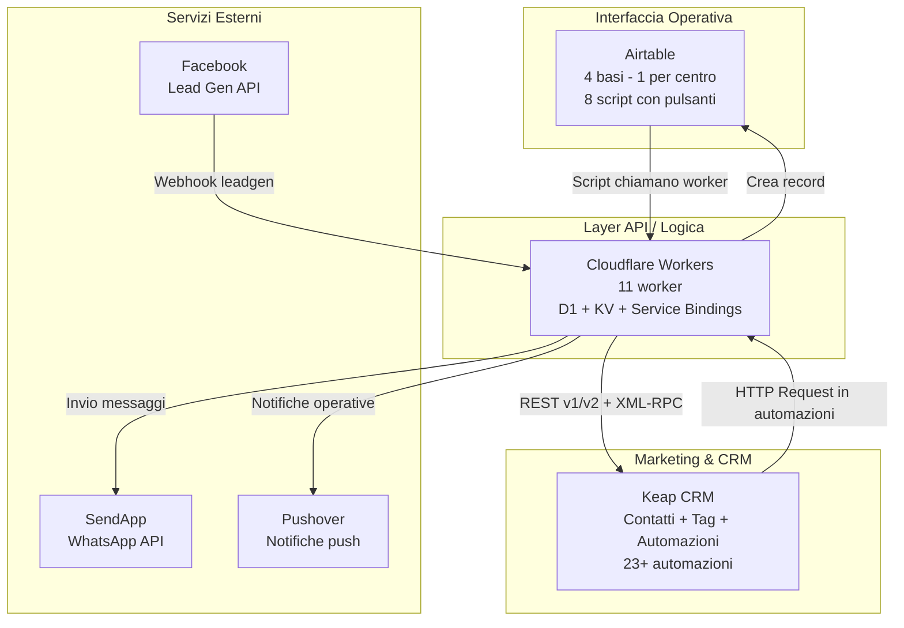

# 01 - Panorama del Sistema

---

## I centri estetici

Il sistema gestisce 4 centri estetici a marchio **No Mas Vello (NMV)**, operanti sotto il brand commerciale **GiVi Beauty**: [Confermato da codice]

| Centro | Stato nel sistema |
|--------|-------------------|
| **Portici** | Pienamente operativo [Confermato da codice] |
| **Arzano** | Pienamente operativo [Confermato da codice] |
| **Torre del Greco** | Pienamente operativo [Confermato da codice] |
| **Pomigliano** | Parzialmente integrato -- base/table Airtable vuoti nel lead-handler [Confermato da codice] |

Ogni centro dispone di una propria base Airtable e di una propria istanza SendApp per l'invio di messaggi WhatsApp. [Confermato da codice]

---

## Architettura generale

### Flusso dei dati

1. **Airtable --> Cloudflare Workers**: Gli operatori dei centri cliccano pulsanti in Airtable. Gli script raccolgono i dati dal record e invocano i worker via `remoteFetchAsync`. [Confermato da codice]
2. **Cloudflare Workers --> Keap CRM**: I worker gestiscono la logica di business e comunicano con Keap tramite REST API v1/v2 e XML-RPC (per i custom field degli appuntamenti/ContactAction). [Confermato da codice]
3. **Keap CRM --> Cloudflare Workers**: Le automazioni Keap inviano HTTP Request ai worker (soprattutto per l'invio di messaggi WhatsApp via SendApp). [Inferito da contesto]
4. **Facebook --> Cloudflare Workers --> Airtable + Keap**: I lead da campagne Facebook arrivano via webhook al `lead-handler`, che li inoltra sia ad Airtable che a Keap. [Confermato da codice]

---

## Orchestrazione basata su tag

Il sistema Keap utilizza i **tag** come meccanismo primario di orchestrazione. Invece di trigger basati su eventi nativi, l'applicazione di un tag specifico avvia l'automazione corrispondente. [Confermato da codice]

**Convenzione di naming dei tag:** [Confermato da codice]
- `AT -> AT -- ...` : Tag usati come **trigger di automazione** (Automation Trigger)
- `S -> S -- ...` : Tag usati come **stato/segmento** del contatto
- `A -- ...` : Tag di **azione/attributo** del contatto

**Esempio di flusso tag-driven:**
1. Worker `apertura-scheda` crea un appuntamento Keap e applica il tag `285` (A1 -- Appuntamento 1) [Confermato da codice]
2. L'automazione Keap 179 ("NMV -- Nuovo Appuntamento") si attiva al tag [Confermato da codice]
3. L'automazione invia una conferma WhatsApp via HTTP Request [Inferito da contesto]
4. Field Timer in Keap attende la data dell'appuntamento per inviare reminder [Confermato da codice]

---

## Sistema Slot Appuntamento A1-A5

Keap non permette di gestire istanze multiple di appuntamento nelle automazioni (non si possono leggere/scrivere dati degli oggetti appuntamento direttamente). [Confermato da codice]

Come **workaround**, il sistema implementa 5 "slot" numerati (A1-A5), ognuno con un set dedicato di: [Confermato da codice]
- **Tag** di trigger (Appuntamento 1, 2, 3, 4, 5)
- **Tag** per tipo trattamento (Fusion/ProSkin per ciascuno slot)
- **Tag** per annullamento e rinvio
- **Custom fields** per data, ora e trattamenti

| Slot | Tag Appuntamento | Tag Fusion | Tag ProSkin | Tag Annullamento | Tag Rinvio | CF Data | CF Ora | CF Trattamenti |
|------|-----------------|------------|-------------|-----------------|------------|---------|--------|----------------|
| A1 | 285 | 307 | 309 | 291 | 299 | 185 | 173 | 133 |
| A2 | 287 | 311 | 313 | 293 | 301 | 179 | 177 | 135 |
| A3 | 289 | 315 | 317 | 295 | 303 | 187 | 181 | 137 |
| A4 | 365 | 367 | 369 | 371 | 373 | 225 | 221 | 219 |
| A5 | 375 | 377 | 379 | 383 | 381 | 231 | 229 | 227 |

[Confermato da codice]

> **Nota:** Gli slot A4 e A5 hanno meno custom fields rispetto ad A1-A3 (mancano Presente, Rinviato, Annullato). [Da verificare]

---

## Multi-centro: isolamento e condivisione

### Risorse condivise (globali)
- Account Keap CRM (unico per tutti i centri) [Confermato da codice]
- Cloudflare Workers (condivisi, il centro viene passato come parametro) [Confermato da codice]
- KV Namespace per token OAuth e log [Confermato da codice]

### Risorse isolate (per centro)
- Base Airtable dedicata con tabelle proprie [Confermato da codice]
- Istanza SendApp dedicata per WhatsApp [Confermato da codice]
- Custom field `Centro` (ID 41) nel contatto Keap [Confermato da codice]
- Custom field `InstanceIDSendapp` (ID 165) nel contatto Keap [Confermato da codice]

### Mappatura SendApp per centro (dal worker `apertura-scheda`)

| Centro | Instance ID SendApp |
|--------|-------------------|
| Portici | `67F7E1DA0EF73` |
| Arzano | `67EFB424D2353` |
| Torre del Greco | `67EFB605B93A1` |
| Pomigliano | `6926D352155D3` |

[Confermato da codice]

> **Attenzione:** Nel `lead-handler`, Pomigliano ha un Instance ID diverso: `68BFEBB41DDD0`. Vedere [06-rischi-debito-tecnico.md](./06-rischi-debito-tecnico.md). [Confermato da codice]

---

## Servizi esterni

| Servizio | Scopo | Integrazione |
|----------|-------|-------------|
| **SendApp** | Invio messaggi WhatsApp ai clienti | API REST, un'istanza per centro [Confermato da codice] |
| **Pushover** | Notifiche push operative (nuovi lead, rinvii, annullamenti, acquisti) | API REST via worker [Confermato da codice] |
| **Facebook Lead Gen API** | Acquisizione lead da campagne pubblicitarie | Webhook verso `lead-handler` worker, Graph API v23.0 per field data [Confermato da codice] |
| **Keap REST API v1** | Gestione contatti, appuntamenti, tag | Endpoint `/crm/rest/v1/` [Confermato da codice] |
| **Keap REST API v2** | Creazione/ricerca contatti | Endpoint `/crm/rest/v2/` [Confermato da codice] |
| **Keap XML-RPC** | Aggiornamento custom fields su ContactAction (appuntamenti) | Endpoint `/crm/xmlrpc/v1` [Confermato da codice] |

---

## Gestione token OAuth Keap

Questo token è necessario per gestire l'autenticazione verso keap nelle sole operazioni sui custom fields di ContactAction (appuntamenti). 
È richiesto come metodo di autenticazione per XML-RPC

Il token OAuth di Keap viene gestito centralmente dal worker `apertura-scheda`: [Confermato da codice]

1. Il token corrente e salvato nel KV namespace `KEAP_TOKENS` con chiave `current_token` [Confermato da codice]
2. Ha un TTL di 12 ore (`TOKEN_TTL_MS: 12 * 60 * 60 * 1000`) [Confermato da codice]
3. Alla scadenza, viene refreshato usando `client_id` + `client_secret` + `refresh_token` [Confermato da codice]
4. Il nuovo token viene salvato sia in KV che in una tabella Airtable `KeapAuth` (per backup) [Confermato da codice]
5. Come fallback, se il refresh fallisce, viene usato `env.KEAP_PAK` (token statico/Personal Access Key) [Confermato da codice]
