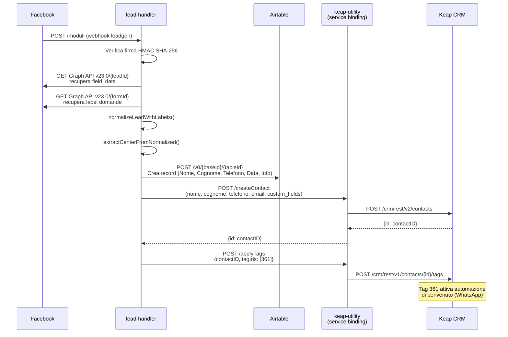
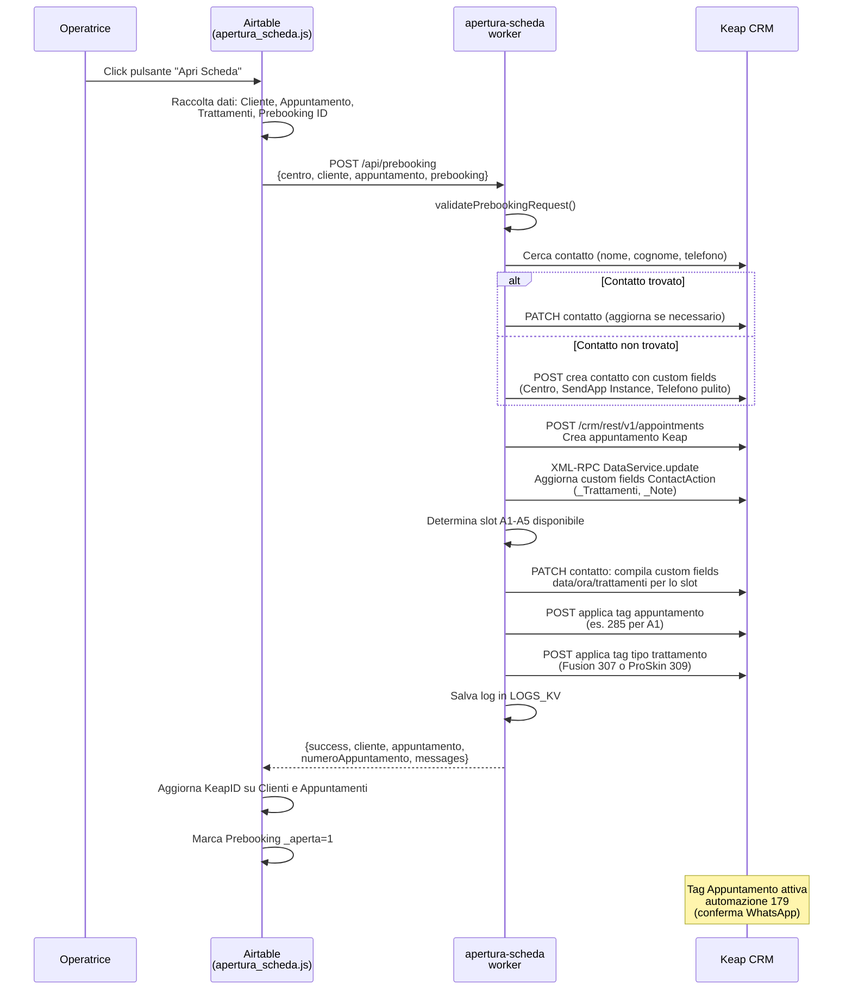
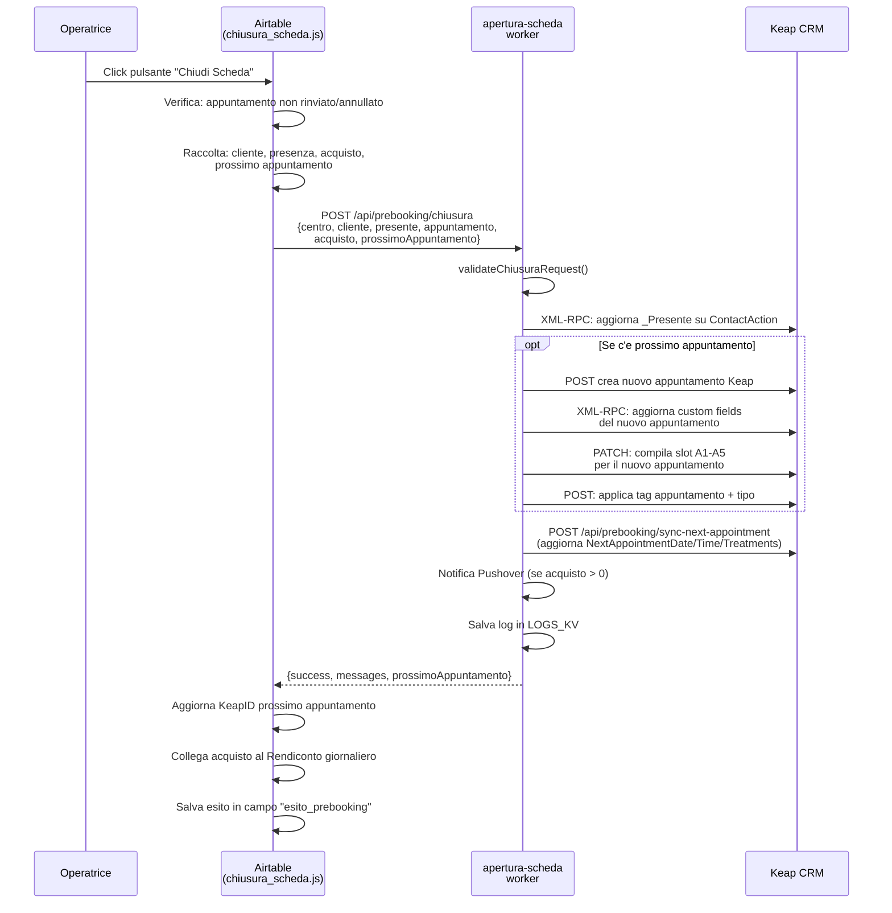
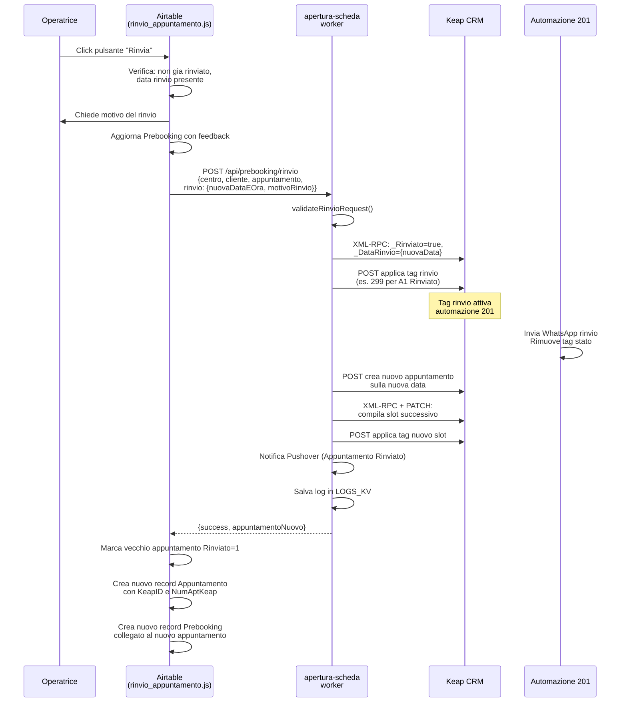
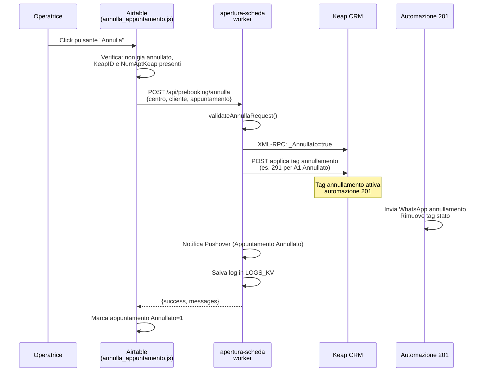
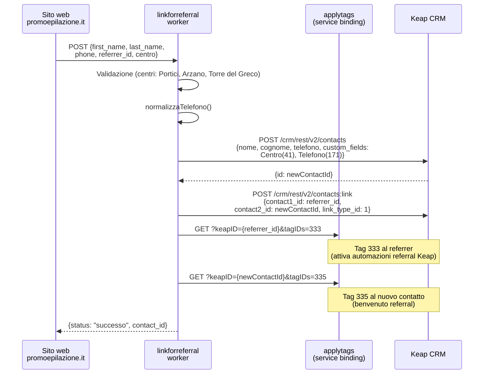
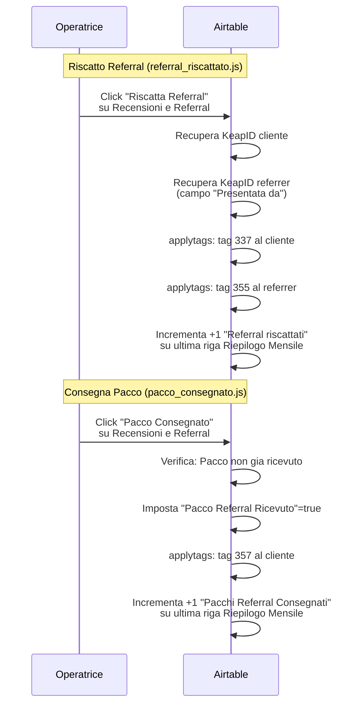
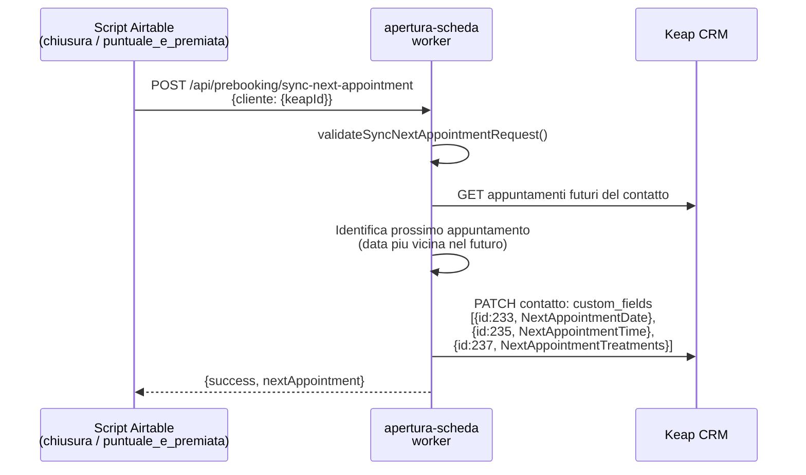

# 03 - Flussi End-to-End

---

## 1. Nuovo Lead da Facebook

### Descrizione

Quando un utente compila un modulo di lead generation su Facebook/Instagram, il webhook invia i dati al worker `lead-handler`. Il worker estrae i campi del lead, determina il centro di appartenenza, crea il record in Airtable e il contatto in Keap, poi applica il tag 361 che attiva le automazioni di benvenuto. [Confermato da codice]

### Diagramma

### Dettagli implementativi

- **Routing per centro**: Il lead-handler usa la mappa `AIRTABLE_ROUTES` per determinare base e tabella Airtable in base al centro estratto dalle risposte del form. [Confermato da codice]
- **Centri supportati**: Arzano (`appMoFcRmbgI8rpH8`/`tblNNPcer4NqOqrpM`), Portici (`appWPbF9yD2PtQrEm`/`tbl21en6aDhgcD7T0`), Torre del Greco (`appCVqkej3tDupAQP`/`tblL6YNidW44GXBEq`). **Pomigliano ha base e table vuoti.** [Confermato da codice]
- **Custom fields Keap** impostati alla creazione: Centro (41), Telefono pulito (171), InstanceIDSendapp (165) [Confermato da codice]
- **SendApp Instance ID per lead-handler**: Portici=`67F7E1DA0EF73`, Arzano=`67EFB424D2353`, Torre del Greco=`67EFB605B93A1`, Pomigliano=`68BFEBB41DDD0` [Confermato da codice]

---

## 2. Apertura Scheda (Prebooking)

### Descrizione

L'operatrice del centro clicca il pulsante "Apri Scheda" su un record Prebooking in Airtable. Lo script raccoglie i dati del cliente e dell'appuntamento, li invia al worker `apertura-scheda`. Il worker cerca o crea il contatto su Keap, crea l'appuntamento Keap, determina lo slot disponibile (A1-A5), compila i custom fields e applica i tag di trigger. L'automazione Keap 179 invia la conferma WhatsApp. [Confermato da codice]

### Diagramma

### Dettagli implementativi

- **Upsert contatto**: Il worker cerca prima per nome/cognome/email. Se trova un solo risultato, lo usa. Se ne trova multipli, filtra per telefono. Se non trova nulla, crea un nuovo contatto. [Confermato da codice]
- **Determinazione tipo trattamento**: Il sistema verifica se i trattamenti contengono nomi di zone corporee (dalla lista `TREATMENT_ZONES`). Se li contiene, il trattamento e di tipo **ProSkin**; altrimenti e **Fusion**. [Confermato da codice]
- **Slot assignment**: Il worker cerca il primo slot (A1-A5) disponibile per il contatto, basandosi sui custom fields data gia compilati. [Inferito da contesto]
- **XML-RPC**: Usato per scrivere i custom fields `_Trattamenti` e `_Note` sull'oggetto ContactAction (appuntamento Keap), in quanto l'API REST non supporta la scrittura di questi campi. [Confermato da codice]

---

## 3. Chiusura Scheda

### Descrizione

L'operatrice clicca "Chiudi Scheda" sul record Prebooking. Lo script verifica che l'appuntamento non sia gia rinviato/annullato, raccoglie dati su presenza, acquisto e prossimo appuntamento, poi chiama il worker. Il worker aggiorna Keap (presenza, custom fields), registra il prossimo appuntamento se presente, e sincronizza i campi NextAppointment. [Confermato da codice]

### Diagramma

### Dettagli implementativi

- **Rendiconto automatico**: Lo script Airtable, dopo la risposta positiva dal worker, cerca nella tabella Rendiconto un record con la stessa data dell'acquisto e collega l'acquisto al campo "Incassi". [Confermato da codice]
- **Notifica Pushover**: Viene inviata una notifica push con suono "cashregister" per ogni acquisto con totale > 0. [Confermato da codice]
- **Validazione acquisto**: Il totale deve essere presente (o Gift Card segnata). Se totale > 0 e Gift Card = true, l'operazione viene bloccata. [Confermato da codice]

---

## 4. Rinvio Appuntamento

### Descrizione

L'operatrice clicca "Rinvia" su un record Appuntamenti. Lo script chiede il motivo, poi invia i dati al worker. Il worker applica il tag di rinvio sullo slot corrispondente (es. tag 299 per A1), che attiva l'automazione Keap 201. Il worker crea un nuovo appuntamento Keap nello slot successivo. Lo script Airtable marca il vecchio appuntamento come rinviato e crea un nuovo record Appuntamento + Prebooking. [Confermato da codice]

### Diagramma

### Dettagli implementativi

- **Notifica apt-monitor**: In parallelo, il worker `apertura-scheda` puo anche notificare l'`apt-monitor` per il tracking in D1. [Inferito da contesto]
- **Conservazione dati**: Il nuovo appuntamento Airtable conserva trattamenti, promozione, prezzo promozione, flag prepagato e operatrice dal vecchio appuntamento. [Confermato da codice]
- **Logica rinvio "lungo"**: Se la nuova data e distante almeno 4 giorni dalla vecchia, il sistema potrebbe applicare logiche diverse. [Confermato da codice]

---

## 5. Annullamento Appuntamento

### Descrizione

Simile al rinvio, ma senza creazione di un nuovo appuntamento. L'operatrice clicca "Annulla", il worker applica il tag di annullamento (es. 291 per A1), che attiva l'automazione Keap 201 per l'invio del messaggio di annullamento. [Confermato da codice]

### Diagramma

### Differenze rispetto al rinvio

- **Nessun nuovo appuntamento** creato ne su Keap ne su Airtable [Confermato da codice]
- **Validazione piu semplice**: non richiede `nuovaDataEOra` [Confermato da codice]
- **Numero appuntamento limitato a 1-4**: La validazione nel worker accetta solo `numeroAppuntamento` tra 1 e 4 per annullamento [Confermato da codice]

---

## 6. Referral Flow

### Descrizione

Il flusso referral gestisce l'intero ciclo: creazione del contatto referral, collegamento al referrer, riscatto del buono e consegna del pacco. Coinvolge il worker `linkforreferral`, lo script `referral_riscattato.js` e lo script `pacco_consegnato.js`. [Confermato da codice]

### Diagramma - Fase 1: Creazione Referral

### Diagramma - Fase 2: Riscatto e Consegna

### Tag del flusso referral

| Fase | Tag | Applicato a | Scopo |
|------|-----|-------------|-------|
| Creazione | 333 | Referrer | Segnala al CRM che il referrer ha portato qualcuno [Confermato da codice] |
| Creazione | 335 | Nuovo contatto | Segnala il nuovo contatto come arrivato da referral [Confermato da codice] |
| Riscatto | 337 | Cliente (referral) | Buono riscattato [Confermato da codice] |
| Riscatto | 355 | Referrer | Premio per il referrer [Confermato da codice] |
| Consegna | 357 | Cliente (referral) | Pacco consegnato [Confermato da codice] |

---

## 7. Sync Next Appointment

### Descrizione

Dopo ogni chiusura scheda (e dopo l'attivazione della promo "Puntuale e Premiata"), il sistema sincronizza i campi `NextAppointmentDate`, `NextAppointmentTime` e `NextAppointmentTreatments` sul contatto Keap. Questi campi sono utilizzati dalle automazioni Keap per schedulare reminder e comunicazioni. [Confermato da codice]

### Diagramma

### Dettagli implementativi

- **Custom fields aggiornati**: `233` (NextAppointmentDate), `235` (NextAppointmentTime), `237` (NextAppointmentTreatments) [Confermato da codice]
- **Chiamato da**: `chiusura_scheda.js` (implicito nel flusso chiusura) e `puntuale_e_premiata.js` (esplicitamente) [Confermato da codice]
- **Scopo per Keap**: Le automazioni Keap usano questi campi nei Field Timer per schedulare reminder prima della data dell'appuntamento. [Inferito da contesto]
