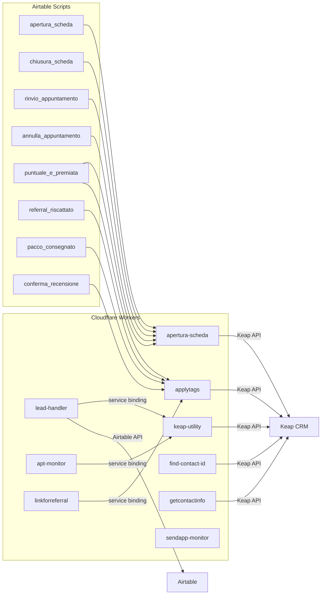

# 04 - Inventario Componenti

---

## Cloudflare Workers

| Worker | Stato | Descrizione | Dipendenze chiave | Endpoints |
|--------|-------|-------------|-------------------|-----------|
| **apertura-scheda** | Attivo | Worker principale. Gestisce l'intero ciclo prebooking: apertura, chiusura, rinvio, annullamento, sync next appointment. Gestisce anche il refresh token OAuth Keap. [Confermato da codice] | KV: `KEAP_TOKENS`, `LOGS_KV`; Env: `KEAP_PAK`, `KEAP_CLIENT_ID`, `KEAP_CLIENT_SECRET`, `PUSHOVER_TOKEN`, `PUSHOVER_USER`, `AIRTABLE_API_TOKEN`, `AUTH_BASE_ID`, `AUTH_RECORD_ID` | `/api/prebooking`, `/api/prebooking/chiusura`, `/api/prebooking/rinvio`, `/api/prebooking/annulla`, `/api/prebooking/sync-next-appointment` |
| **keap-utility** | Attivo | Proxy generico verso Keap API. Usato come service binding da altri worker per operazioni CRUD su contatti, tag e appuntamenti. [Confermato da codice] | Env: `KEAP_ACCESS_TOKEN`, `KEAP_BASE` | `/createContact`, `/findContact`, `/getContactInfo/{id}`, `/applyTags`, `/getAppointment/{id}` |
| **lead-handler** | Attivo | Riceve webhook Facebook Lead Gen, verifica firma HMAC, estrae dati lead via Graph API, determina il centro, inoltra a Airtable e Keap, applica tag 361. [Confermato da codice] | Service binding: `keap-utility`; Env: `VERIFY_TOKEN`, `APP_SECRET`, `PAGE_TOKENS_JSON`, `AIRTABLE_API_KEY`, `GRAPH_TOKEN` | `/moduli` (webhook), `/form` (placeholder) |
| **sendapp-monitor** | Attivo | Monitora lo stato delle istanze SendApp. Contiene polyfill Node.js bundlato da Wrangler. [Inferito da contesto] | Env: varie config SendApp | -- |
| **apt-monitor** | Attivo | Monitora rinvii e annullamenti. Riceve eventi via POST `/event`, li salva in D1, invia notifiche Pushover istantanee. Ha un trigger `scheduled` per riepilogo giornaliero alle 20:00. [Confermato da codice] | D1: `DB`; Service binding: `KEAP_UTILITY`; Env: `PUSHOVER_TOKEN`, `PUSHOVER_USER`, `PUSHOVER_DEVICE`, `PUSHOVER_TITLE` | `/health`, `/event` |
| **applytags** | Attivo | Applica uno o piu tag a un contatto Keap. Riceve parametri via query string (`keapID`, `tagIDs` separati da virgola). Usato sia direttamente dagli script Airtable che come service binding. [Confermato da codice] | Env: `KEAP_API_KEY` | `/?keapID=...&tagIDs=...` |
| **find-contact-id** | Attivo | Cerca un contatto Keap per nome, cognome e telefono. Restituisce l'ID del contatto se trovato. CORS limitato a `promoepilazione.it`. **Contiene bug `contatti.lenght`**. [Confermato da codice] | Env: `KEAP_API_KEY` | POST con `{first_name, last_name, phone}` |
| **getcontactinfo** | Attivo | Restituisce i dettagli completi di un contatto Keap per ID, inclusi i custom fields. CORS: `*` in risposta OK, `promoepilazione.it` in errore. [Confermato da codice] | Env: `KEAP_API_KEY` | `/?keapID=...` |
| **linkforreferral** | Attivo | Crea un nuovo contatto referral su Keap, lo collega al referrer tramite `contacts:link`, applica tag 333 (referrer) e 335 (nuovo contatto). CORS limitato a `promoepilazione.it`. [Confermato da codice] | Service binding: `APPLY_TAGS` (verso `applytags`); Env: `KEAP_API_KEY` | POST con `{first_name, last_name, phone, referrer_id, centro}` |
| **prebooking** | **Legacy** | Worker precedente per gestione prebooking. Include route `/setAppointment` (non implementata), `/cancelAppointment/{id}`, `/resetAppointment/{id}`, `/setOpportunity` (non implementata). Usa `getAppointmentInfo` e `getContactInfo` interni. [Confermato da codice] | Env: config Keap, SendApp | `/setAppointment`, `/cancelAppointment/{id}`, `/resetAppointment/{id}`, `/setOpportunity` |
| **leadgen** | **Legacy** | Worker precedente per lead generation. Riceveva dati lead via POST e li inviava in parallelo ad Airtable, Pushover e SendApp. Struttura piu semplice del `lead-handler` attuale (nessun webhook Facebook, nessuna creazione contatto Keap). [Confermato da codice] | Env: `AIRTABLE_API_KEY`, `AIRTABLE_BASE_ID`, `AIRTABLE_TABLE_NAME`, `PUSHOVER_TOKEN`, `PUSHOVER_USER`, `SENDAPP_API_KEY` | POST root |

---

## Airtable Scripts

| Script | Stato | Tabella | Descrizione | Worker chiamato | Tag applicati |
|--------|-------|---------|-------------|----------------|---------------|
| **apertura_scheda.js** | Attivo | Prebooking | Raccoglie dati cliente, appuntamento e trattamenti dal record Prebooking. Chiama `/api/prebooking`. Aggiorna KeapID su Clienti e Appuntamenti, marca `_aperta=1`. [Confermato da codice] | `apertura-scheda` | Delegati al worker (slot tag + tipo trattamento) |
| **chiusura_scheda.js** | Attivo | Prebooking | Verifica stato appuntamento (non rinviato/annullato). Raccoglie dati presenza, acquisto (con prodotti/trattamenti), prossimo appuntamento. Chiama `/api/prebooking/chiusura`. Aggiorna Rendiconto. [Confermato da codice] | `apertura-scheda` | Delegati al worker |
| **rinvio_appuntamento.js** | Attivo | Appuntamenti | Verifica che l'appuntamento non sia gia rinviato e che la data di rinvio sia presente. Chiede il motivo all'operatrice. Chiama `/api/prebooking/rinvio`. Crea nuovo record Appuntamento + Prebooking. [Confermato da codice] | `apertura-scheda` | Delegati al worker (tag rinvio slot) |
| **annulla_appuntamento.js** | Attivo | Appuntamenti | Verifica che l'appuntamento non sia gia annullato. Chiama `/api/prebooking/annulla`. Marca `Annullato=1` sul record. [Confermato da codice] | `apertura-scheda` | Delegati al worker (tag annullamento slot) |
| **puntuale_e_premiata.js** | Attivo | Recensioni e Referral | Attiva la promo "Puntuale e Premiata" sul cliente. Aggiorna campo `Promo Fidelity`. Chiama `sync-next-appointment`. Applica tag 387. [Confermato da codice] | `apertura-scheda`, `applytags` | 387 |
| **referral_riscattato.js** | Attivo | Recensioni e Referral | Riscatta il buono referral. Recupera KeapID del cliente e del referrer (campo "Presentata da"). Applica tag 337 al cliente e 355 al referrer. Incrementa contatore "Referral riscattati" sull'ultima riga di Riepilogo Mensile. [Confermato da codice] | `applytags` | 337 (cliente), 355 (referrer) |
| **pacco_consegnato.js** | Attivo | Recensioni e Referral | Segna pacco ricevuto. Verifica doppioni (non gia ricevuto). Imposta `Pacco Referral Ricevuto=true`. Applica tag 357. Incrementa contatore "Pacchi Referral Consegnati" sull'ultima riga di Riepilogo Mensile. [Confermato da codice] | `applytags` | 357 |
| **conferma_recensione.js** | Attivo | Recensioni e Referral | Conferma che la recensione e stata inviata. Applica tag 155 al cliente. Aggiorna campo `Recensione Inviata=true`. [Confermato da codice] | `applytags` | 155 |

---

## Riepilogo dipendenze tra componenti

