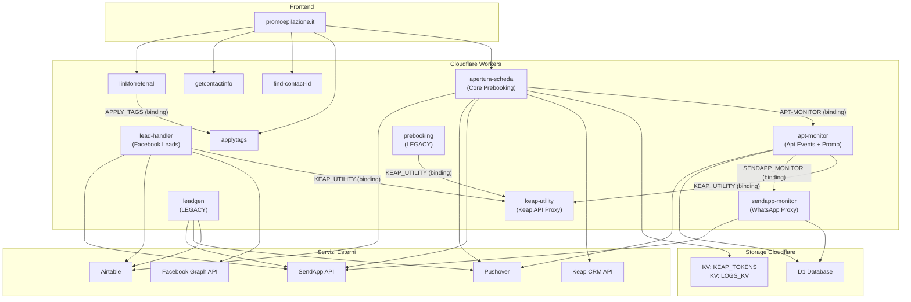

# Infrastruttura Cloudflare Workers — Panoramica

> Ultima revisione: 2026-04-02

## Introduzione

Questo documento descrive l'infrastruttura serverless basata su **Cloudflare Workers** utilizzata da Givi Beauty per gestire il ciclo di vita degli appuntamenti, l'acquisizione di lead, le integrazioni con il CRM Keap (Infusionsoft) e l'invio di messaggi WhatsApp tramite SendApp.

L'infrastruttura comprende **11 workers** di cui **8 attivi**, **2 legacy** e **1 da verificare** nelle sue dipendenze.

---

## Regola architetturale fondamentale — Service Bindings

> **Le comunicazioni tra worker interni avvengono SEMPRE tramite Service Binding, mai tramite chiamate HTTP dirette.**
>
> Quando un worker deve chiamare un altro worker dello stesso account Cloudflare, deve usare un Service Binding configurato nelle impostazioni del worker e accessibile tramite `env.NOME_BINDING.fetch()`. Non si usano mai URL esterni (es. `workers.dev`) per comunicare tra worker interni allo stesso account.
>
> Questo principio si applica a tutte le nuove integrazioni e deve essere rispettato in ogni modifica al codice.

---

## Architettura generale

## Centri operativi

I worker gestiscono appuntamenti e lead per i seguenti centri:

| Centro           | Codice / Identificativo |
|------------------|------------------------|
| Portici          | Attivo in tutti i worker |
| Arzano           | Attivo in tutti i worker |
| Torre del Greco  | Attivo in tutti i worker |
| Pomigliano       | Attivo in apertura-scheda e lead-handler, assente in linkforreferral |

---

## Pattern architetturali

### Service Bindings
I worker comunicano tra loro tramite **Service Bindings** di Cloudflare, evitando chiamate HTTP esterne. Questa è una regola architetturale obbligatoria.

Binding attivi:
- `KEAP_UTILITY` — usato da `lead-handler`, `apt-monitor`, `prebooking`
- `APPLY_TAGS` — usato da `linkforreferral`
- `SENDAPP_MONITOR` — usato da `apt-monitor` per notifiche promo WhatsApp
- `APT-MONITOR` — usato da `apertura-scheda` per inviare eventi rinvio/annullamento

### Storage
- **KV Namespaces**: token OAuth Keap (TTL 12h) e log operazioni (TTL 30 giorni)
- **D1 Database**: logging messaggi WhatsApp (`sendapp-monitor`) e eventi appuntamento + notifiche promo (`apt-monitor`)

### Autenticazione verso Keap
- **OAuth 2.0** con refresh token automatico — usato da `apertura-scheda` e `keap-utility`
- **Personal Access Key (PAK)** — usato dai worker più semplici (`applytags`, `find-contact-id`, `getcontactinfo`)

### Cron Jobs
- `sendapp-monitor`: esecuzione oraria
- `apt-monitor`: esecuzione giornaliera alle 20:00 Europe/Rome

---

## Struttura della documentazione

| File | Contenuto |
|------|-----------|
| [README.md](README.md) | Questa panoramica |
| [inventario-progetti-cloudflare.md](inventario-progetti-cloudflare.md) | Tabella inventario di tutti i worker |
| [mappa-workers-e-routes.md](mappa-workers-e-routes.md) | Mappa completa delle route |
| [bindings-storage-env.md](bindings-storage-env.md) | Bindings, storage e variabili d'ambiente |
| [cron-jobs.md](cron-jobs.md) | Documentazione cron job |
| [dipendenze-esterne.md](dipendenze-esterne.md) | Dipendenze da servizi esterni |
| [sicurezza-configurazione.md](sicurezza-configurazione.md) | Analisi sicurezza e configurazione |
| [workers/*.md](workers/) | Documentazione dettagliata per ciascun worker |

---

## Glossario

| Termine | Significato |
|---------|-------------|
| **Prebooking** | Il flusso di creazione/gestione appuntamento nel CRM Keap |
| **PAK** | Personal Access Key — chiave API Keap v1 |
| **SendApp** | Servizio di invio messaggi WhatsApp via API |
| **KV** | Cloudflare Workers KV — storage key-value distribuito |
| **D1** | Cloudflare D1 — database SQLite serverless |
| **Service Binding** | Collegamento diretto tra worker Cloudflare senza HTTP esterno. Obbligatorio per comunicazioni inter-worker interne. |
| **Custom Field** | Campo personalizzato nel CRM Keap, identificato da ID numerico |
