# Infrastruttura Cloudflare Workers — Panoramica

> Ultima revisione: 2026-03-26

## Introduzione

Questo documento descrive l'infrastruttura serverless basata su **Cloudflare Workers** utilizzata da Givi Beauty per gestire il ciclo di vita degli appuntamenti, l'acquisizione di lead, le integrazioni con il CRM Keap (Infusionsoft) e l'invio di messaggi WhatsApp tramite SendApp.

L'infrastruttura comprende **11 workers** di cui **8 attivi**, **2 legacy** e **1 da verificare** nelle sue dipendenze. [Confermato da codice]

---

## Architettura generale

```mermaid
graph TD
    subgraph "Frontend"
        WEB["promoepilazione.it"]
    end

    subgraph "Cloudflare Workers"
        AS["apertura-scheda<br/>(Core Prebooking)"]
        KU["keap-utility<br/>(Keap API Proxy)"]
        LH["lead-handler<br/>(Facebook Leads)"]
        SM["sendapp-monitor<br/>(WhatsApp Proxy)"]
        AM["apt-monitor<br/>(Apt Events)"]
        AT["applytags"]
        FC["find-contact-id"]
        GC["getcontactinfo"]
        LR["linkforreferral"]
        PB["prebooking<br/>(LEGACY)"]
        LG["leadgen<br/>(LEGACY)"]
    end

    subgraph "Storage Cloudflare"
        KV["KV: KEAP_TOKENS<br/>KV: LOGS_KV"]
        D1["D1 Database"]
    end

    subgraph "Servizi Esterni"
        KEAP["Keap CRM API"]
        SENDAPP["SendApp API"]
        PUSHOVER["Pushover"]
        FB["Facebook Graph API"]
        AIRTABLE["Airtable"]
    end

    WEB --> AS
    WEB --> AT
    WEB --> FC
    WEB --> GC
    WEB --> LR

    AS --> KU
    AS --> KV
    AS --> KEAP
    AS --> SENDAPP
    AS --> PUSHOVER
    AS --> AIRTABLE

    LH --> KU
    LH --> FB
    LH --> AIRTABLE
    LH --> SENDAPP

    SM --> D1
    SM --> SENDAPP

    AM --> D1
    AM --> KU
    AM --> PUSHOVER

    LR --> AT

    PB --> KU

    LG --> AIRTABLE
    LG --> PUSHOVER
    LG --> SENDAPP
```

## Centri operativi

I worker gestiscono appuntamenti e lead per i seguenti centri: [Confermato da codice]

| Centro           | Codice / Identificativo |
|------------------|------------------------|
| Portici          | Attivo in tutti i worker |
| Arzano           | Attivo in tutti i worker |
| Torre del Greco  | Attivo in tutti i worker |
| Pomigliano       | Attivo in apertura-scheda e lead-handler, assente in linkforreferral |

---

## Pattern architetturali

### Service Bindings
I worker comunicano tra loro tramite **Service Bindings** di Cloudflare, evitando chiamate HTTP esterne: [Confermato da codice]

- `KEAP_UTILITY` — usato da `lead-handler`, `apt-monitor`, `prebooking`
- `APPLY_TAGS` — usato da `linkforreferral`

### Storage
- **KV Namespaces**: token OAuth Keap (TTL 12h) e log operazioni (TTL 30 giorni) [Confermato da codice]
- **D1 Database**: logging messaggi WhatsApp (`sendapp-monitor`) e eventi appuntamento (`apt-monitor`) [Confermato da codice]

### Autenticazione verso Keap
- **OAuth 2.0** con refresh token automatico — usato da `apertura-scheda` e `keap-utility` [Confermato da codice]
- **Personal Access Key (PAK)** — usato dai worker piu semplici (`applytags`, `find-contact-id`, `getcontactinfo`) [Confermato da codice]

### Cron Jobs
- `sendapp-monitor`: esecuzione oraria [Confermato da codice]
- `apt-monitor`: esecuzione giornaliera alle 20:00 Europe/Rome [Confermato da codice]

---

## Struttura della documentazione

| File | Contenuto |
|------|-----------|
| [README.md](README.md) | Questa panoramica |
| [inventario-progetti-cloudflare.md](inventario-progetti-cloudflare.md) | Tabella inventario di tutti i worker |
| [mappa-workers-e-routes.md](mappa-workers-e-routes.md) | Mappa completa delle route |
| [bindings-storage-env.md](bindings-storage-env.md) | Bindings, storage e variabili d'ambiente |
| [cron-jobs.md](cron-jobs.md) | Documentazione cron job |
| [dipendenze-esterne.md](dipendenze-esterne.md) | Dipendenze da servizi esterni |
| [sicurezza-configurazione.md](sicurezza-configurazione.md) | Analisi sicurezza e configurazione |
| [workers/*.md](workers/) | Documentazione dettagliata per ciascun worker |

---

## Glossario

| Termine | Significato |
|---------|-------------|
| **Prebooking** | Il flusso di creazione/gestione appuntamento nel CRM Keap |
| **PAK** | Personal Access Key — chiave API Keap v1 |
| **SendApp** | Servizio di invio messaggi WhatsApp via API |
| **KV** | Cloudflare Workers KV — storage key-value distribuito |
| **D1** | Cloudflare D1 — database SQLite serverless |
| **Service Binding** | Collegamento diretto tra worker Cloudflare senza HTTP esterno |
| **Custom Field** | Campo personalizzato nel CRM Keap, identificato da ID numerico |
