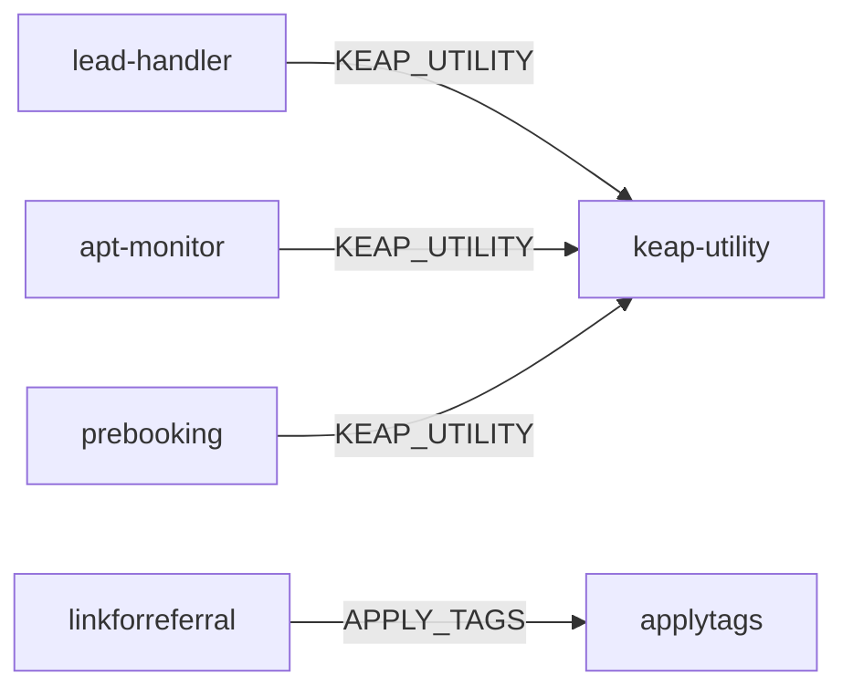

# Bindings, Storage e Variabili d'Ambiente

> Ultima revisione: 2026-03-26

## KV Namespaces

| Namespace | Utilizzato da | Contenuto | TTL | Note |
|-----------|--------------|-----------|-----|------|
| `KEAP_TOKENS` | `apertura-scheda`, `keap-utility` | Token OAuth Keap (access + refresh) | 12 ore | Refresh automatico alla scadenza [Confermato da codice] |
| `LOGS_KV` | `apertura-scheda` | Log operazioni (apertura, chiusura, rinvio, annullamento) | 30 giorni | Consultabili via `GET /api/logs` [Confermato da codice] |

## D1 Database

| Worker | Utilizzo | Tabelle | Note |
|--------|----------|---------|------|
| `sendapp-monitor` | Logging messaggi WhatsApp inviati/falliti | Messaggi con stato, retry, timestamp | Usato per report e retention [Confermato da codice] |
| `apt-monitor` | Logging eventi appuntamento (rinvii, annullamenti) | Eventi con tipo, data, dettagli | Usato per riepilogo giornaliero [Confermato da codice] |

## Service Bindings

| Binding | Worker sorgente | Worker destinazione | Descrizione |
|---------|----------------|-------------------|-------------|
| `KEAP_UTILITY` | `lead-handler` | `keap-utility` | Proxy Keap API [Confermato da codice] |
| `KEAP_UTILITY` | `apt-monitor` | `keap-utility` | Proxy Keap API [Confermato da codice] |
| `KEAP_UTILITY` | `prebooking` | `keap-utility` | Proxy Keap API [Confermato da codice] |
| `APPLY_TAGS` | `linkforreferral` | `applytags` | Applicazione tag [Confermato da codice] |

---

## Variabili d'ambiente per worker

### apertura-scheda

| Variabile | Tipo | Descrizione |
|-----------|------|-------------|
| `KEAP_PAK` | Secret | Personal Access Key Keap [Confermato da codice] |
| `KEAP_CLIENT_ID` | Secret | OAuth Client ID Keap [Confermato da codice] |
| `KEAP_CLIENT_SECRET` | Secret | OAuth Client Secret Keap [Confermato da codice] |
| `PUSHOVER_TOKEN` | Secret | Token API Pushover per notifiche [Confermato da codice] |
| `PUSHOVER_USER` | Secret | User key Pushover [Confermato da codice] |
| `AUTH_BASE_ID` | Config | ID base Airtable per backup token [Confermato da codice] |
| `AUTH_RECORD_ID` | Config | ID record Airtable per backup token [Confermato da codice] |
| `AIRTABLE_API_TOKEN` | Secret | Token API Airtable [Confermato da codice] |

### keap-utility

| Variabile | Tipo | Descrizione |
|-----------|------|-------------|
| `KEAP_ACCESS_TOKEN` | Secret | Access token Keap (potrebbe essere OAuth o PAK) [Confermato da codice] |

### lead-handler

| Variabile | Tipo | Descrizione |
|-----------|------|-------------|
| `VERIFY_TOKEN` | Secret | Token verifica webhook Meta [Confermato da codice] |
| `APP_SECRET` | Secret | App Secret Facebook per verifica HMAC [Confermato da codice] |
| `PAGE_TOKENS_JSON` | Secret | JSON con token per le pagine Facebook [Confermato da codice] |
| `GRAPH_TOKEN` | Secret | Token Graph API Facebook [Confermato da codice] |
| `AIRTABLE_API_KEY` | Secret | API Key Airtable [Confermato da codice] |

### sendapp-monitor

| Variabile | Tipo | Descrizione |
|-----------|------|-------------|
| `SENDAPP_URL` | Config | URL base API SendApp [Confermato da codice] |
| `RECONNECT_BASE` | Config | URL base per riconnessione istanze [Confermato da codice] |

### apt-monitor

| Variabile | Tipo | Descrizione |
|-----------|------|-------------|
| `PUSHOVER_TOKEN` | Secret | Token API Pushover [Confermato da codice] |
| `PUSHOVER_USER` | Secret | User key Pushover [Confermato da codice] |
| `PUSHOVER_DEVICE` | Config | Device Pushover per invio mirato [Confermato da codice] |
| `PUSHOVER_TITLE` | Config | Titolo default notifiche [Confermato da codice] |

### applytags

| Variabile | Tipo | Descrizione |
|-----------|------|-------------|
| `KEAP_API_KEY` | Secret | API Key Keap v1 (PAK) [Confermato da codice] |

### find-contact-id

| Variabile | Tipo | Descrizione |
|-----------|------|-------------|
| `KEAP_API_KEY` | Secret | API Key Keap v1 (PAK) [Da verificare] |

### getcontactinfo

| Variabile | Tipo | Descrizione |
|-----------|------|-------------|
| `KEAP_API_KEY` | Secret | API Key Keap v1 (PAK) [Da verificare] |

### linkforreferral

| Variabile | Tipo | Descrizione |
|-----------|------|-------------|
| (env vars) | — | Variabili d'ambiente non completamente mappate [Da verificare] |

### prebooking (LEGACY)

| Variabile | Tipo | Descrizione |
|-----------|------|-------------|
| — | — | Usa Service Binding KEAP_UTILITY [Confermato da codice] |

### leadgen (LEGACY)

| Variabile | Tipo | Descrizione |
|-----------|------|-------------|
| `AIRTABLE_API_KEY` | Secret | API Key Airtable [Confermato da codice] |
| `AIRTABLE_BASE_ID` | Config | ID base Airtable [Confermato da codice] |
| `AIRTABLE_TABLE_NAME` | Config | Nome tabella Airtable [Confermato da codice] |
| `PUSHOVER_TOKEN` | Secret | Token API Pushover [Confermato da codice] |
| `PUSHOVER_USER` | Secret | User key Pushover [Confermato da codice] |
| `SENDAPP_API_KEY` | Secret | API Key SendApp [Confermato da codice] |

---

## Matrice riassuntiva Storage

| Worker | KV | D1 | Service Binding (usa) | Service Binding (espone) |
|--------|----|----|----------------------|------------------------|
| apertura-scheda | KEAP_TOKENS, LOGS_KV | — | — | — |
| keap-utility | KEAP_TOKENS | — | — | Si (KEAP_UTILITY) |
| lead-handler | — | — | KEAP_UTILITY | — |
| sendapp-monitor | — | Si | — | — |
| apt-monitor | — | Si | KEAP_UTILITY | — |
| applytags | — | — | — | Si (APPLY_TAGS) |
| find-contact-id | — | — | — | — |
| getcontactinfo | — | — | — | — |
| linkforreferral | — | — | APPLY_TAGS | — |
| prebooking | — | — | KEAP_UTILITY | — |
| leadgen | — | — | — | — |
