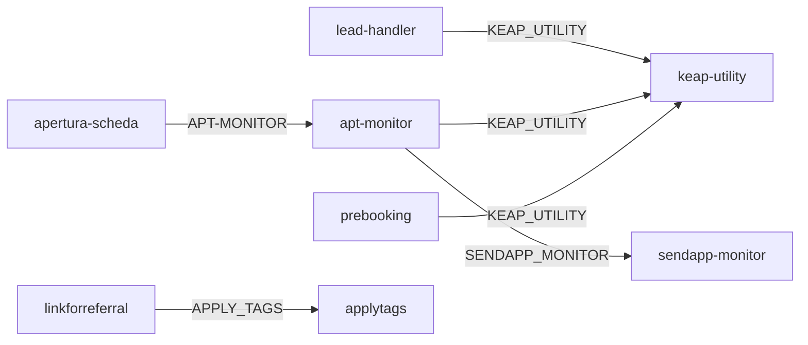

# Bindings, Storage e Variabili d'Ambiente

> Ultima revisione: 2026-04-02

## Regola architetturale — Service Bindings

> **Le comunicazioni tra worker interni avvengono SEMPRE tramite Service Binding, mai tramite chiamate HTTP dirette.**
>
> Quando un worker deve chiamare un altro worker dello stesso account Cloudflare, deve usare un Service Binding configurato nelle impostazioni del worker e accessibile via `env.NOME_BINDING.fetch()`. Non si usano mai URL esterni (es. `workers.dev`) per comunicare tra worker interni.

---

## KV Namespaces

| Namespace | Utilizzato da | Contenuto | TTL | Note |
|-----------|--------------|-----------|-----|------|
| `KEAP_TOKENS` | `apertura-scheda`, `keap-utility` | Token OAuth Keap (access + refresh) | 12 ore | Refresh automatico alla scadenza |
| `LOGS_KV` | `apertura-scheda` | Log operazioni (apertura, chiusura, rinvio, annullamento) | 30 giorni | Consultabili via `GET /api/logs` |

## D1 Database

| Worker | Database | Tabelle principali | Note |
|--------|----------|--------------------|------|
| `sendapp-monitor` | `sendapp_monitor` | `messages` (stato invii WhatsApp, retry, timestamp) | Usato per report e retention |
| `apt-monitor` | `apt_monitor_db` | `events` (rinvii/annullamenti), `promo_notifications` (notifiche promo Puntuale e Premiata) | Usato per riepilogo giornaliero e rilevamento promo |

## Service Bindings

| Binding | Worker sorgente | Worker destinazione | Nome binding | Descrizione |
|---------|----------------|-------------------|--------------|-------------|
| `KEAP_UTILITY` | `lead-handler` | `keap-utility` | KEAP_UTILITY | Proxy Keap API |
| `KEAP_UTILITY` | `apt-monitor` | `keap-utility` | KEAP_UTILITY | Proxy Keap API |
| `KEAP_UTILITY` | `prebooking` | `keap-utility` | KEAP_UTILITY | Proxy Keap API |
| `APPLY_TAGS` | `linkforreferral` | `applytags` | APPLY_TAGS | Applicazione tag |
| `SENDAPP_MONITOR` | `apt-monitor` | `sendapp-monitor` | SENDAPP_MONITOR | Invio WhatsApp notifiche promo "Puntuale e Premiata" |
| `APT-MONITOR` | `apertura-scheda` | `apt-monitor` | APT-MONITOR | Invio eventi rinvio/annullamento per monitoraggio e rilevamento promo |

---

## Variabili d'ambiente per worker

### apertura-scheda

| Variabile | Tipo | Descrizione |
|-----------|------|-------------|
| `KEAP_PAK` | Secret | Personal Access Key Keap |
| `KEAP_CLIENT_ID` | Secret | OAuth Client ID Keap |
| `KEAP_CLIENT_SECRET` | Secret | OAuth Client Secret Keap |
| `PUSHOVER_TOKEN` | Secret | Token API Pushover per notifiche |
| `PUSHOVER_USER` | Secret | User key Pushover |
| `AUTH_BASE_ID` | Config | ID base Airtable per backup token |
| `AUTH_RECORD_ID` | Config | ID record Airtable per backup token |
| `AIRTABLE_API_TOKEN` | Secret | Token API Airtable |

### keap-utility

| Variabile | Tipo | Descrizione |
|-----------|------|-------------|
| `KEAP_ACCESS_TOKEN` | Secret | Access token Keap (OAuth o PAK) |

### lead-handler

| Variabile | Tipo | Descrizione |
|-----------|------|-------------|
| `VERIFY_TOKEN` | Secret | Token verifica webhook Meta |
| `APP_SECRET` | Secret | App Secret Facebook per verifica HMAC |
| `PAGE_TOKENS_JSON` | Secret | JSON con token per le pagine Facebook |
| `GRAPH_TOKEN` | Secret | Token Graph API Facebook |
| `AIRTABLE_API_KEY` | Secret | API Key Airtable |

### sendapp-monitor

| Variabile | Tipo | Descrizione |
|-----------|------|-------------|
| `SENDAPP_URL` | Config | URL base API SendApp |
| `RECONNECT_BASE` | Config | URL base per riconnessione istanze |

### apt-monitor

| Variabile | Tipo | Descrizione |
|-----------|------|-------------|
| `PUSHOVER_TOKEN` | Secret | Token API Pushover |
| `PUSHOVER_USER` | Secret | User key Pushover |
| `PUSHOVER_DEVICE` | Config | Device Pushover per invio mirato |
| `PUSHOVER_TITLE` | Config | Titolo default notifiche |
| `SENDAPP_ACCESS_TOKEN` | Secret | Access token per autenticazione verso sendapp-monitor (usato nelle chiamate via Service Binding per la promo) |

### applytags

| Variabile | Tipo | Descrizione |
|-----------|------|-------------|
| `KEAP_API_KEY` | Secret | API Key Keap v1 (PAK) |

### find-contact-id

| Variabile | Tipo | Descrizione |
|-----------|------|-------------|
| `KEAP_API_KEY` | Secret | API Key Keap v1 (PAK) [Da verificare] |

### getcontactinfo

| Variabile | Tipo | Descrizione |
|-----------|------|-------------|
| `KEAP_API_KEY` | Secret | API Key Keap v1 (PAK) [Da verificare] |

### linkforreferral

| Variabile | Tipo | Descrizione |
|-----------|------|-------------|
| (env vars) | — | Variabili d'ambiente non completamente mappate [Da verificare] |

### prebooking (LEGACY)

| Variabile | Tipo | Descrizione |
|-----------|------|-------------|
| — | — | Usa Service Binding KEAP_UTILITY |

### leadgen (LEGACY)

| Variabile | Tipo | Descrizione |
|-----------|------|-------------|
| `AIRTABLE_API_KEY` | Secret | API Key Airtable |
| `AIRTABLE_BASE_ID` | Config | ID base Airtable |
| `AIRTABLE_TABLE_NAME` | Config | Nome tabella Airtable |
| `PUSHOVER_TOKEN` | Secret | Token API Pushover |
| `PUSHOVER_USER` | Secret | User key Pushover |
| `SENDAPP_API_KEY` | Secret | API Key SendApp |

---

## Matrice riassuntiva Storage

| Worker | KV | D1 | Service Binding (usa) | Service Binding (espone) |
|--------|----|----|----------------------|------------------------|
| apertura-scheda | KEAP_TOKENS, LOGS_KV | — | APT-MONITOR | — |
| keap-utility | KEAP_TOKENS | — | — | Sì (KEAP_UTILITY) |
| lead-handler | — | — | KEAP_UTILITY | — |
| sendapp-monitor | — | Sì | — | Sì (SENDAPP_MONITOR) |
| apt-monitor | — | Sì | KEAP_UTILITY, SENDAPP_MONITOR | Sì (APT-MONITOR) |
| applytags | — | — | — | Sì (APPLY_TAGS) |
| find-contact-id | — | — | — | — |
| getcontactinfo | — | — | — | — |
| linkforreferral | — | — | APPLY_TAGS | — |
| prebooking | — | — | KEAP_UTILITY | — |
| leadgen | — | — | — | — |
