# Cron Jobs

> Ultima revisione: 2026-03-26

## Panoramica

Due worker utilizzano i **Cron Triggers** di Cloudflare per esecuzioni pianificate. [Confermato da codice]

```mermaid
gantt
    title Timeline giornaliera Cron Jobs (Europe/Rome)
    dateFormat HH:mm
    axisFormat %H:%M

    section sendapp-monitor
    Esecuzione oraria (ogni ora)     :crit, 00:00, 24h
    Report giornaliero (09:00)       :milestone, 09:00, 0h

    section apt-monitor
    Riepilogo giornaliero (20:00)    :milestone, 20:00, 0h
```

---

## sendapp-monitor — Cron orario

| Parametro | Valore |
|-----------|--------|
| **Schedule** | `0 * * * *` (ogni ora) [Confermato da codice] |
| **Timezone** | Europe/Rome [Confermato da codice] |
| **Tipo** | `scheduled` event handler |

### Logica di esecuzione

Ad ogni esecuzione oraria il worker: [Confermato da codice]

1. **Verifica ora locale**: se sono le **09:00 Europe/Rome**, genera e invia il **report giornaliero** con statistiche dei messaggi inviati/falliti
2. **Cleanup retention**: elimina dal database D1 i record piu vecchi del periodo di retention configurato
3. **Retry messaggi falliti**: tenta il re-invio di messaggi precedentemente falliti, con logica di backoff

### Gestione errori

- Se un'istanza SendApp restituisce errore **"Instance ID Invalidated"**, il worker tenta un **reconnect automatico** usando `RECONNECT_BASE` [Confermato da codice]
- I messaggi falliti vengono riprovati con **delay progressivo** [Confermato da codice]

---

## apt-monitor — Cron giornaliero

| Parametro | Valore |
|-----------|--------|
| **Schedule** | `0 18 * * *` (18:00 UTC = 20:00 Europe/Rome) [Confermato da codice] |
| **Timezone** | UTC (convertito: 20:00 Europe/Rome) [Inferito da contesto] |
| **Tipo** | `scheduled` event handler |

### Logica di esecuzione

Alle 20:00 Europe/Rome il worker: [Confermato da codice]

1. **Recupera eventi del giorno** dal database D1 (rinvii e annullamenti registrati durante la giornata)
2. **Compone riepilogo** aggregando gli eventi per tipo e centro
3. **Invia notifica Pushover** con il riepilogo completo della giornata

### Nota sulla doppia notifica

Il worker `apt-monitor` invia due tipi di notifiche Pushover: [Confermato da codice]

- **Istantanea**: ogni volta che riceve un evento su `POST /event`, invia subito una notifica Pushover
- **Riepilogo**: alle 20:00, invia un riepilogo cumulativo di tutti gli eventi della giornata

---

## Tabella riassuntiva

| Worker | Cron Expression | Ora locale (Europe/Rome) | Azione principale |
|--------|----------------|--------------------------|-------------------|
| `sendapp-monitor` | `0 * * * *` | Ogni ora intera | Retry, cleanup, report (09:00) |
| `apt-monitor` | `0 18 * * *` | 20:00 | Riepilogo giornaliero Pushover |
