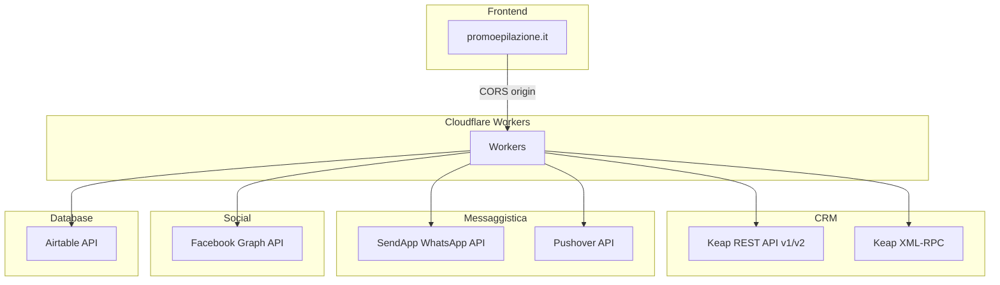

# Dipendenze Esterne

> Ultima revisione: 2026-03-26

## Panoramica

I Cloudflare Workers dipendono da 6 servizi esterni principali per il funzionamento. [Confermato da codice]

---

## 1. Keap REST API (v1 e v2)

| Parametro | Dettaglio |
|-----------|-----------|
| **URL base** | `https://api.infusionsoft.com/crm/rest/v1/` e `v2/` |
| **Autenticazione** | OAuth 2.0 (apertura-scheda, keap-utility) oppure PAK via header (applytags, find-contact-id, getcontactinfo) |
| **Usato da** | `apertura-scheda`, `keap-utility`, `applytags`, `find-contact-id`, `getcontactinfo`, `linkforreferral`, `lead-handler` (via binding), `apt-monitor` (via binding), `prebooking` (via binding) |
| **Operazioni** | Creazione/aggiornamento contatti, applicazione tag, gestione appuntamenti, lettura custom fields |
| **Rate limiting** | Standard Keap API limits [Da verificare] |
| **Criticita** | Se il token OAuth scade e il refresh fallisce, `apertura-scheda` tenta recovery da Airtable [Confermato da codice] |

[Confermato da codice]

---

## 2. Keap XML-RPC

| Parametro | Dettaglio |
|-----------|-----------|
| **URL base** | `https://api.infusionsoft.com/crm/xmlrpc/v1` |
| **Autenticazione** | PAK (Personal Access Key) |
| **Usato da** | `apertura-scheda` (per custom fields appuntamento) |
| **Operazioni** | Lettura/scrittura custom fields sugli appuntamenti (non disponibile via REST API) |
| **Criticita** | API legacy Keap, potrebbe essere deprecata in futuro [Inferito da contesto] |

[Confermato da codice]

---

## 3. SendApp WhatsApp API

| Parametro | Dettaglio |
|-----------|-----------|
| **URL base** | Configurato via env `SENDAPP_URL` |
| **Autenticazione** | API Key / Instance ID |
| **Usato da** | `apertura-scheda`, `sendapp-monitor`, `lead-handler`, `leadgen` (legacy) |
| **Operazioni** | Invio messaggi WhatsApp, verifica stato istanza, riconnessione |
| **Istanze per centro** | Portici: `67F7E1DA0EF73`, Arzano: `67EFB424D2353`, Torre del Greco: `67EFB605B93A1`, Pomigliano: varia per worker |
| **Criticita** | L'ID istanza Pomigliano differisce tra `apertura-scheda` (`6926D352155D3`) e `lead-handler` (`68BFEBB41DDD0`) [Confermato da codice] |
| **Gestione errori** | Reconnect automatico su "Instance ID Invalidated" [Confermato da codice] |

[Confermato da codice]

---

## 4. Pushover Notification API

| Parametro | Dettaglio |
|-----------|-----------|
| **URL base** | `https://api.pushover.net/1/messages.json` |
| **Autenticazione** | Token + User key |
| **Usato da** | `apertura-scheda`, `apt-monitor`, `leadgen` (legacy) |
| **Operazioni** | Invio notifiche push (errori critici, riepilogo giornaliero, eventi appuntamento) |
| **Criticita** | Nessuna nota particolare — servizio stabile [Inferito da contesto] |

[Confermato da codice]

---

## 5. Facebook Graph API

| Parametro | Dettaglio |
|-----------|-----------|
| **URL base** | `https://graph.facebook.com/v*` |
| **Autenticazione** | Page Token (per webhook) + Graph Token |
| **Usato da** | `lead-handler` |
| **Operazioni** | Ricezione lead da Facebook Lead Ads, recupero dati lead |
| **Sicurezza** | Verifica firma HMAC SHA-256 sui webhook [Confermato da codice] |
| **Criticita** | I token delle pagine scadono e richiedono rinnovo manuale [Inferito da contesto] |

[Confermato da codice]

---

## 6. Airtable API

| Parametro | Dettaglio |
|-----------|-----------|
| **URL base** | `https://api.airtable.com/v0/` |
| **Autenticazione** | API Key / Bearer Token |
| **Usato da** | `apertura-scheda` (backup token OAuth), `lead-handler` (salvataggio lead), `leadgen` (legacy) |
| **Basi per centro (lead-handler)** | Arzano: `appMoFcRmbgI8rpH8`, Portici: `appWPbF9yD2PtQrEm`, Torre del Greco: `appCVqkej3tDupAQP`, Pomigliano: non configurata [Confermato da codice] |
| **Criticita** | Pomigliano ha base e table vuoti (`""`) in `lead-handler` — i lead di Pomigliano non vengono salvati su Airtable [Confermato da codice] |

[Confermato da codice]

---

## 7. promoepilazione.it (Origine CORS)

| Parametro | Dettaglio |
|-----------|-----------|
| **Ruolo** | Frontend che origina richieste ai worker |
| **CORS** | Alcuni worker restringono a `promoepilazione.it`, altri usano `*` [Confermato da codice] |
| **Usato da** | `applytags` (CORS ristretto), `getcontactinfo` (CORS inconsistente), altri worker |

---

## Matrice dipendenze per worker

| Worker | Keap REST | Keap XML-RPC | SendApp | Pushover | Facebook | Airtable |
|--------|-----------|-------------|---------|----------|----------|----------|
| apertura-scheda | Diretto | Diretto | Diretto | Diretto | — | Diretto |
| keap-utility | Diretto | — | — | — | — | — |
| lead-handler | Via binding | — | Diretto | — | Diretto | Diretto |
| sendapp-monitor | — | — | Diretto | — | — | — |
| apt-monitor | Via binding | — | — | Diretto | — | — |
| applytags | Diretto | — | — | — | — | — |
| find-contact-id | Diretto | — | — | — | — | — |
| getcontactinfo | Diretto | — | — | — | — | — |
| linkforreferral | Via binding | — | — | — | — | — |
| prebooking | Via binding | — | — | — | — | — |
| leadgen | — | — | Diretto | Diretto | — | Diretto |
