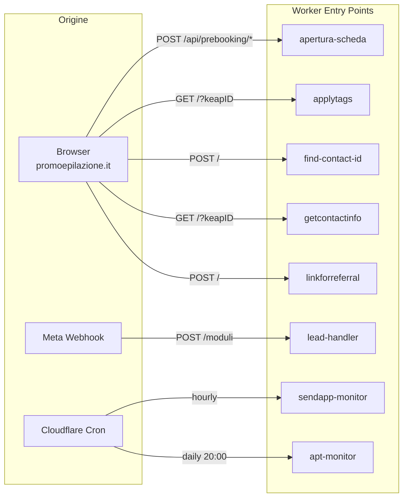

# Mappa Workers e Routes

> Ultima revisione: 2026-03-26

## Indice

- [apertura-scheda](#apertura-scheda)
- [keap-utility](#keap-utility)
- [lead-handler](#lead-handler)
- [sendapp-monitor](#sendapp-monitor)
- [apt-monitor](#apt-monitor)
- [applytags](#applytags)
- [find-contact-id](#find-contact-id)
- [getcontactinfo](#getcontactinfo)
- [linkforreferral](#linkforreferral)
- [prebooking (LEGACY)](#prebooking-legacy)
- [leadgen (LEGACY)](#leadgen-legacy)

---

## apertura-scheda

Worker principale per la gestione del ciclo di vita degli appuntamenti.

| Metodo | Path | Descrizione | Auth | Request | Response |
|--------|------|-------------|------|---------|----------|
| `POST` | `/api/prebooking/apertura` | Crea/aggiorna contatto + appuntamento | No [Inferito da contesto] | JSON body | JSON risultato operazione |
| `POST` | `/api/prebooking/chiusura` | Chiude appuntamento, aggiorna presenza e custom fields | No [Inferito da contesto] | JSON body | JSON risultato |
| `POST` | `/api/prebooking/rinvio` | Rinvia (riprogramma) appuntamento | No [Inferito da contesto] | JSON body | JSON risultato |
| `POST` | `/api/prebooking/annulla` | Annulla appuntamento | No [Inferito da contesto] | JSON body | JSON risultato |
| `POST` | `/api/prebooking/sync-next-appointment` | Sincronizza i campi next appointment sul contatto | No [Inferito da contesto] | JSON body | JSON risultato |
| `GET` | `/api/logs` | Visualizza log operazioni da KV | No [Inferito da contesto] | Query params | JSON log entries |
| `GET` | `/health` | Health check | No | — | `200 OK` |
| `POST` | `/api/apertura-scheda` | **DEPRECATO** — Vecchio endpoint apertura | No | JSON body | JSON risultato |
| `POST` | `/api/prebooking` | **DEPRECATO** — Vecchio endpoint prebooking | No | JSON body | JSON risultato |

[Confermato da codice]

---

## keap-utility

Proxy centralizzato per le API Keap, usato come Service Binding da altri worker.

| Metodo | Path | Descrizione | Auth | Request | Response |
|--------|------|-------------|------|---------|----------|
| `POST` | `/createContact` | Crea un nuovo contatto in Keap | No (interno) | JSON body con dati contatto | JSON contatto creato |
| `GET` | `/getContactInfo/:id` | Recupera info contatto per ID | No (interno) | Path param `:id` | JSON dati contatto |
| `GET` | `/findContact?email=` | Cerca contatto per email | No (interno) | Query param `email` | JSON risultato ricerca |
| `POST` | `/applyTags` | Applica tag a un contatto | No (interno) | JSON body con contactId e tagIds | JSON conferma |
| `GET` | `/getAppointment/:id` | Recupera dati appuntamento | No (interno) | Path param `:id` | JSON appuntamento |

[Confermato da codice]

---

## lead-handler

Cattura lead da Facebook e form generici.

| Metodo | Path | Descrizione | Auth | Request | Response |
|--------|------|-------------|------|---------|----------|
| `POST` | `/moduli` | Webhook Facebook per ricezione lead | Verifica HMAC SHA-256 (Meta) | JSON payload Meta | `200 OK` |
| `POST` | `/form` | Form semplice per acquisizione lead | No [Inferito da contesto] | JSON body con dati lead | JSON risultato |

[Confermato da codice]

---

## sendapp-monitor

Proxy WhatsApp con logging e retry.

| Metodo | Path | Descrizione | Auth | Request | Response |
|--------|------|-------------|------|---------|----------|
| `POST` | `/send` | Invia messaggio WhatsApp via SendApp | No [Inferito da contesto] | JSON body con destinatario e messaggio | JSON risultato invio |
| `GET` | `/report` | Report messaggi inviati | No [Inferito da contesto] | Query params per filtri | JSON report |
| `POST` | `/setup` | Configurazione iniziale | No [Inferito da contesto] | JSON body | JSON conferma |
| `POST` | `/webhook` | Webhook per callback SendApp | No [Inferito da contesto] | JSON payload | `200 OK` |
| **Cron** | — | Esecuzione oraria: report giornaliero (09:00) + cleanup retention | — | — | — |

[Confermato da codice]

---

## apt-monitor

Monitor eventi appuntamento con notifiche Pushover.

| Metodo | Path | Descrizione | Auth | Request | Response |
|--------|------|-------------|------|---------|----------|
| `POST` | `/event` | Riceve evento appuntamento (rinvio/annullamento) | No [Inferito da contesto] | JSON body evento | `200 OK` |
| `GET` | `/health` | Health check | No | — | `200 OK` |
| **Cron** | — | Giornaliero 20:00 Europe/Rome: riepilogo via Pushover | — | — | — |

[Confermato da codice]

---

## applytags

Endpoint semplice per applicazione tag.

| Metodo | Path | Descrizione | Auth | Request | Response |
|--------|------|-------------|------|---------|----------|
| `GET` | `/?keapID=X&tagIDs=1,2,3` | Applica tag al contatto specificato | No (CORS limitato a promoepilazione.it) | Query params | JSON conferma |

[Confermato da codice]

---

## find-contact-id

Ricerca contatto per dati anagrafici.

| Metodo | Path | Descrizione | Auth | Request | Response |
|--------|------|-------------|------|---------|----------|
| `POST` | `/` | Cerca contatto per nome, cognome, telefono | No [Inferito da contesto] | `{ "first_name", "last_name", "phone" }` | JSON contatto trovato |

[Confermato da codice]

---

## getcontactinfo

Recupero informazioni contatto.

| Metodo | Path | Descrizione | Auth | Request | Response |
|--------|------|-------------|------|---------|----------|
| `GET` | `/?keapID=X` | Recupera info contatto da Keap | No (CORS inconsistente) | Query param `keapID` | JSON dati contatto |

[Confermato da codice]

---

## linkforreferral

Creazione link referral con gestione tag.

| Metodo | Path | Descrizione | Auth | Request | Response |
|--------|------|-------------|------|---------|----------|
| `POST` | `/` | Crea contatto referral e applica tag | No [Inferito da contesto] | `{ "first_name", "last_name", "phone", "referrer_id", "centro" }` | JSON risultato |

[Confermato da codice]

---

## prebooking (LEGACY)

Vecchio handler appuntamenti — sostituito da `apertura-scheda`.

| Metodo | Path | Descrizione | Auth | Request | Response |
|--------|------|-------------|------|---------|----------|
| `POST` | `/cancelAppointment/:id` | Annulla appuntamento | No | Path param `:id` | JSON risultato |
| `POST` / `GET` | `/resetAppointment/:id` | Reset appuntamento | No | Path param `:id` | JSON risultato |
| `POST` | `/setAppointment` | **STUB VUOTO** — Non implementato | — | — | — |
| `POST` | `/setOpportunity` | **STUB VUOTO** — Non implementato | — | — | — |

[Confermato da codice]

---

## leadgen (LEGACY)

Vecchio handler lead — mai completato.

| Metodo | Path | Descrizione | Auth | Request | Response |
|--------|------|-------------|------|---------|----------|
| `POST` | `/` | Riceve dati lead | No [Inferito da contesto] | `{ "nome", "email", "telefono" }` | JSON risultato |

[Confermato da codice]

---

## Diagramma flusso richieste

