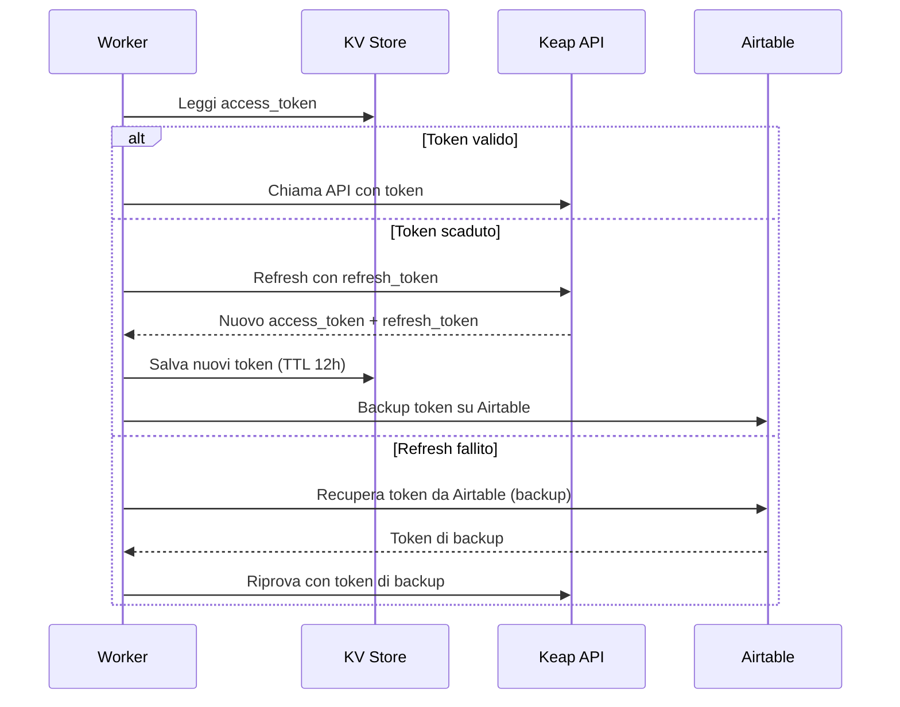

# Sicurezza e Configurazione

> Ultima revisione: 2026-03-26

## Panoramica sicurezza

Questa sezione analizza le pratiche di sicurezza adottate nei Cloudflare Workers, evidenziando punti di forza e aree di miglioramento.

---

## 1. CORS (Cross-Origin Resource Sharing)

| Worker | Configurazione CORS | Valutazione |
|--------|-------------------|-------------|
| `applytags` | Ristretto a `promoepilazione.it` | Buono [Confermato da codice] |
| `getcontactinfo` | **Inconsistente**: `*` nelle risposte di successo, `promoepilazione.it` nelle risposte di errore | Problematico [Confermato da codice] |
| `apertura-scheda` | [Da verificare] | — |
| `find-contact-id` | [Da verificare] | — |
| `linkforreferral` | [Da verificare] | — |
| `lead-handler` | Non applicabile (webhook server-to-server) | N/A |
| `sendapp-monitor` | [Da verificare] | — |

### Raccomandazione

Uniformare la configurazione CORS a `promoepilazione.it` per tutti i worker esposti al frontend. L'uso di `*` permette a qualsiasi sito di invocare l'endpoint. [Inferito da contesto]

---

## 2. Autenticazione degli endpoint

| Livello | Worker | Meccanismo |
|---------|--------|-----------|
| **Verificato** | `lead-handler` (webhook Meta) | HMAC SHA-256 con `APP_SECRET` [Confermato da codice] |
| **Nessuno** | `apertura-scheda`, `keap-utility`, `applytags`, `find-contact-id`, `getcontactinfo`, `linkforreferral`, `sendapp-monitor`, `apt-monitor` | Nessuna autenticazione sugli endpoint HTTP [Inferito da contesto] |

### Dettaglio verifica webhook Meta (lead-handler)

```
Algoritmo: HMAC SHA-256
Chiave: APP_SECRET (Facebook App Secret)
Payload: corpo della richiesta (raw body)
Header verificato: X-Hub-Signature-256
```
[Confermato da codice]

### Rischio

La mancanza di autenticazione sugli endpoint significa che chiunque conosca l'URL del worker puo invocarlo. Questo e mitigato dal fatto che:
- I worker Cloudflare non sono indicizzati dai motori di ricerca [Inferito da contesto]
- Gli URL dei worker non sono facilmente indovinabili [Inferito da contesto]
- Le operazioni richiedono dati validi (es. keapID reali) per avere effetto [Inferito da contesto]

Tuttavia, endpoint come `POST /api/prebooking/annulla` potrebbero essere abusati se l'URL fosse scoperto. [Inferito da contesto]

---

## 3. Gestione token OAuth Keap



[Confermato da codice]

### Dettaglio

| Aspetto | Implementazione |
|---------|----------------|
| **Storage primario** | KV namespace `KEAP_TOKENS` con TTL 12 ore [Confermato da codice] |
| **Backup** | Airtable (base `AUTH_BASE_ID`, record `AUTH_RECORD_ID`) [Confermato da codice] |
| **Refresh** | Automatico alla scadenza, salva sia su KV che su Airtable [Confermato da codice] |
| **Recovery** | Se il refresh fallisce, tenta recupero da Airtable [Confermato da codice] |
| **Rischio** | Se entrambi KV e Airtable hanno token scaduti/invalidi, il sistema si blocca e richiede intervento manuale [Inferito da contesto] |

---

## 4. Gestione segreti

### Buone pratiche adottate

- Tutte le API key, token e secret sono configurati come **variabili d'ambiente** (environment variables) in Cloudflare, non hardcoded nel codice [Confermato da codice]
- I secret di Cloudflare Workers sono **criptati at rest** e non visibili nella dashboard dopo il salvataggio [Inferito da contesto]

### Aree di attenzione

| Problema | Dettaglio | Gravita |
|----------|-----------|---------|
| **ID hardcoded** | Numerosi ID Keap (tag, custom fields, appuntamenti) sono hardcoded nel codice sorgente | Bassa — sono ID interni, non segreti [Confermato da codice] |
| **Base/Table Airtable hardcoded** | In `lead-handler`, gli ID base e tabella Airtable per ogni centro sono nel codice | Bassa — non sono segreti ma rendono il codice fragile [Confermato da codice] |
| **SendApp Instance ID hardcoded** | Gli ID istanza SendApp per ogni centro sono nel codice, con discrepanza tra worker | Media — la discrepanza puo causare invii al centro sbagliato [Confermato da codice] |

---

## 5. Validazione input

| Worker | Validazione | Note |
|--------|------------|------|
| `lead-handler` | Verifica firma HMAC | Solo per webhook Meta [Confermato da codice] |
| `apertura-scheda` | [Da verificare] | Probabile validazione base dei campi obbligatori |
| `find-contact-id` | Minima | Accetta POST con JSON body [Confermato da codice] |
| `getcontactinfo` | Minima | Accetta query param `keapID` [Confermato da codice] |
| `applytags` | Minima | Accetta query params `keapID` e `tagIDs` [Confermato da codice] |

---

## 6. Logging e audit

| Meccanismo | Worker | Dettaglio |
|-----------|--------|-----------|
| KV Logs | `apertura-scheda` | Log operazioni con TTL 30 giorni, consultabili via `/api/logs` [Confermato da codice] |
| D1 Database | `sendapp-monitor` | Log messaggi WhatsApp con stato e retry [Confermato da codice] |
| D1 Database | `apt-monitor` | Log eventi appuntamento [Confermato da codice] |
| Pushover | `apertura-scheda`, `apt-monitor` | Notifiche push per errori critici e riepilogo [Confermato da codice] |

---

## 7. Riepilogo raccomandazioni

| # | Raccomandazione | Priorita | Stato |
|---|----------------|----------|-------|
| 1 | Uniformare CORS a `promoepilazione.it` per tutti i worker frontend | Media | Da implementare |
| 2 | Aggiungere autenticazione (es. shared secret / Bearer token) sugli endpoint critici (`apertura-scheda`, `apt-monitor`) | Alta | Da valutare |
| 3 | Risolvere discrepanza SendApp Instance ID per Pomigliano tra `apertura-scheda` e `lead-handler` | Media | Da correggere |
| 4 | Spostare gli ID hardcoded in variabili d'ambiente o configurazione esterna | Bassa | Da valutare |
| 5 | Completare o dismettere i worker legacy (`prebooking`, `leadgen`) | Bassa | Da pianificare |
| 6 | Configurare Airtable per Pomigliano in `lead-handler` (base e table attualmente vuoti) | Media | Da completare |
| 7 | Correggere CORS inconsistente in `getcontactinfo` | Bassa | Da correggere |
