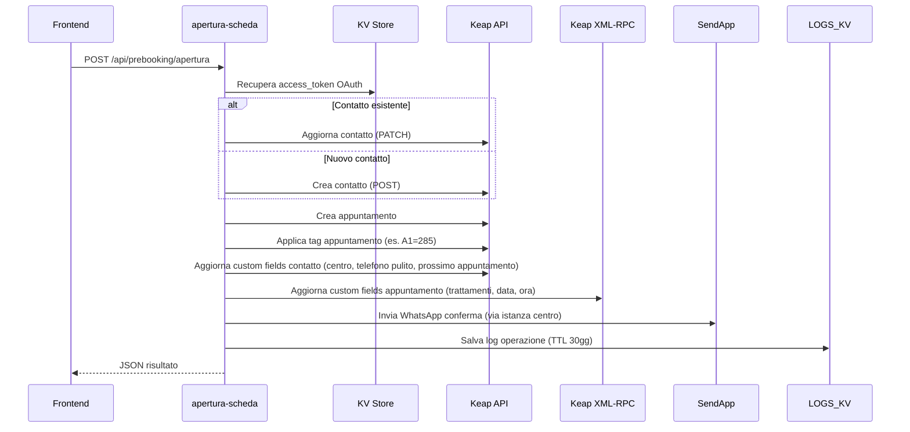

# apertura-scheda

> Ultima revisione: 2026-03-26

## Scopo

Worker principale per la gestione del **ciclo di vita completo degli appuntamenti** (prebooking). Gestisce apertura, chiusura, rinvio e annullamento degli appuntamenti nel CRM Keap, con aggiornamento dei custom fields, applicazione tag, invio notifiche WhatsApp e logging. [Confermato da codice]

## Stato

**Attivo** — Worker core dell'infrastruttura, ~2759 linee di codice. [Confermato da codice]

---

## Entry Points

| Tipo | Dettaglio |
|------|-----------|
| HTTP | Route `POST /api/prebooking/*` e altri endpoint |
| Cron | Nessuno |
| Service Binding | Non esposto come binding; chiama direttamente le API Keap |

---

## Routes

| Metodo | Path | Descrizione | Stato |
|--------|------|-------------|-------|
| `POST` | `/api/prebooking/apertura` | Crea/aggiorna contatto e appuntamento | Attivo [Confermato da codice] |
| `POST` | `/api/prebooking/chiusura` | Chiude appuntamento, aggiorna presenza e custom fields | Attivo [Confermato da codice] |
| `POST` | `/api/prebooking/rinvio` | Rinvia (riprogramma) appuntamento | Attivo [Confermato da codice] |
| `POST` | `/api/prebooking/annulla` | Annulla appuntamento | Attivo [Confermato da codice] |
| `POST` | `/api/prebooking/sync-next-appointment` | Sincronizza campi prossimo appuntamento sul contatto | Attivo [Confermato da codice] |
| `GET` | `/api/logs` | Visualizza log operazioni da KV | Attivo [Confermato da codice] |
| `GET` | `/health` | Health check | Attivo [Confermato da codice] |
| `POST` | `/api/apertura-scheda` | **DEPRECATO** | Legacy [Confermato da codice] |
| `POST` | `/api/prebooking` | **DEPRECATO** | Legacy [Confermato da codice] |

---

## Input/Output

### POST /api/prebooking/apertura

**Request:**
```json
{
  "first_name": "Mario",
  "last_name": "Rossi",
  "phone": "+393331234567",
  "email": "mario@example.com",
  "centro": "Portici",
  "trattamenti": "Epilazione",
  "data": "2026-04-01",
  "ora": "10:00",
  "appointment_number": 1
}
```
[Inferito da contesto — struttura esatta da verificare]

**Response:**
```json
{
  "success": true,
  "contactId": 12345,
  "appointmentId": 67890,
  "message": "Appuntamento creato"
}
```
[Inferito da contesto]

### POST /api/prebooking/chiusura

**Request:**
```json
{
  "contactId": 12345,
  "appointmentId": 67890,
  "centro": "Portici",
  "presente": true,
  "appointment_number": 1
}
```
[Inferito da contesto]

### POST /api/prebooking/rinvio

**Request:**
```json
{
  "contactId": 12345,
  "appointmentId": 67890,
  "centro": "Portici",
  "nuova_data": "2026-04-15",
  "nuova_ora": "14:00",
  "appointment_number": 1
}
```
[Inferito da contesto]

### POST /api/prebooking/annulla

**Request:**
```json
{
  "contactId": 12345,
  "appointmentId": 67890,
  "centro": "Portici",
  "appointment_number": 1
}
```
[Inferito da contesto]

---

## Storage

| Tipo | Nome | Utilizzo |
|------|------|----------|
| KV | `KEAP_TOKENS` | Storage token OAuth Keap (access_token + refresh_token, TTL 12h) [Confermato da codice] |
| KV | `LOGS_KV` | Log operazioni con TTL 30 giorni [Confermato da codice] |
| Service Binding | — | Non usa service bindings, chiama direttamente Keap [Confermato da codice] |

---

## Variabili d'ambiente

| Variabile | Tipo | Descrizione |
|-----------|------|-------------|
| `KEAP_PAK` | Secret | Personal Access Key per API Keap (usato per XML-RPC) [Confermato da codice] |
| `KEAP_CLIENT_ID` | Secret | OAuth Client ID [Confermato da codice] |
| `KEAP_CLIENT_SECRET` | Secret | OAuth Client Secret [Confermato da codice] |
| `PUSHOVER_TOKEN` | Secret | Token API Pushover [Confermato da codice] |
| `PUSHOVER_USER` | Secret | User key Pushover [Confermato da codice] |
| `AUTH_BASE_ID` | Config | ID base Airtable per backup token [Confermato da codice] |
| `AUTH_RECORD_ID` | Config | ID record Airtable per backup token [Confermato da codice] |
| `AIRTABLE_API_TOKEN` | Secret | Token API Airtable [Confermato da codice] |

---

## Servizi esterni

| Servizio | Utilizzo | Autenticazione |
|----------|----------|---------------|
| Keap REST API v1/v2 | CRUD contatti, tag, appuntamenti | OAuth 2.0 [Confermato da codice] |
| Keap XML-RPC | Custom fields appuntamenti | PAK [Confermato da codice] |
| SendApp | Invio messaggi WhatsApp ai clienti | Instance ID per centro [Confermato da codice] |
| Pushover | Notifiche errori critici | Token + User [Confermato da codice] |
| Airtable | Backup token OAuth | Bearer token [Confermato da codice] |

---

## Flusso logico

### Apertura appuntamento



### Chiusura appuntamento

1. Riceve dati chiusura (contactId, appointmentId, presenza)
2. Aggiorna stato appuntamento su Keap
3. Aggiorna custom fields presenza
4. Se presente: applica tag di completamento
5. Aggiorna campi prossimo appuntamento (sync)
6. Log operazione

### Rinvio appuntamento

1. Riceve dati rinvio con nuova data/ora
2. Applica tag rinvio (es. RINVIO.A1=299)
3. Aggiorna appuntamento con nuova data
4. Aggiorna custom fields (data, ora)
5. Invia WhatsApp con nuova data
6. Log operazione

### Annullamento appuntamento

1. Riceve dati annullamento
2. Applica tag annullamento (es. CANCEL.A1=291)
3. Annulla appuntamento su Keap
4. Aggiorna custom fields
5. Log operazione

[Confermato da codice]

---

## Configurazione hardcoded

### APPOINTMENT_TAGS

Mappa dei tag Keap per numero appuntamento e tipo di operazione: [Confermato da codice]

```javascript
APPOINTMENT_TAGS: {
  // Tag appuntamento standard
  A1: 285, A2: 287, A3: 289, A4: 365, A5: 375,

  // Tag per trattamento PROSKIN
  PROSKIN: { A1: 309, A2: 313, A3: 317, A4: 369, A5: 379 },

  // Tag per trattamento FUSION
  FUSION:  { A1: 307, A2: 311, A3: 315, A4: 367, A5: 377 },

  // Tag annullamento
  CANCEL:  { A1: 291, A2: 293, A3: 295, A4: 371, A5: 383 },

  // Tag rinvio
  RINVIO:  { A1: 299, A2: 301, A3: 303, A4: 373, A5: 381 }
}
```

### CENTRO_TO_SENDAPP

Mappatura centro -> Instance ID SendApp: [Confermato da codice]

| Centro | SendApp Instance ID |
|--------|-------------------|
| Portici | `67F7E1DA0EF73` |
| Arzano | `67EFB424D2353` |
| Torre del Greco | `67EFB605B93A1` |
| Pomigliano | `6926D352155D3` |

### CUSTOM_FIELDS — Contatto

Campi personalizzati del contatto Keap: [Confermato da codice]

| Campo | ID Keap |
|-------|---------|
| CENTRO | 41 |
| SENDAPP_INSTANCE | 165 |
| CLEAN_PHONE | 171 |
| NEXT_APPOINTMENT_DATE | 233 |
| NEXT_APPOINTMENT_TIME | 235 |
| NEXT_APPOINTMENT_TREATMENTS | 237 |

### APPOINTMENT_FIELDS

Custom fields per appuntamento (per numero appuntamento): [Confermato da codice]

| Appuntamento | Trattamenti (ID) | Data (ID) | Ora (ID) |
|-------------|-------------------|-----------|----------|
| 1 | 133 | 185 | 173 |
| 2 | 135 | 179 | 177 |
| 3+ | [Da verificare] | [Da verificare] | [Da verificare] |

---

## Criticita e note

| # | Tipo | Descrizione | Gravita |
|---|------|-------------|---------|
| 1 | **Discrepanza SendApp** | L'Instance ID di Pomigliano (`6926D352155D3`) differisce da quello in `lead-handler` (`68BFEBB41DDD0`). Potrebbe causare invio a istanza sbagliata. | Alta [Confermato da codice] |
| 2 | **Dimensione codice** | ~2759 linee in un singolo worker — difficile da manutenere e testare | Media [Confermato da codice] |
| 3 | **Route deprecate** | `/api/apertura-scheda` e `/api/prebooking` sono ancora presenti — da rimuovere dopo verifica che nessun client le usi | Bassa [Confermato da codice] |
| 4 | **Dipendenza multipla** | Il worker dipende da 5 servizi esterni — un guasto su uno qualsiasi puo bloccare l'operazione | Media [Inferito da contesto] |
| 5 | **Token OAuth recovery** | Il fallback su Airtable per i token e robusto ma aggiunge un single point of failure aggiuntivo | Bassa [Confermato da codice] |
| 6 | **Nessuna autenticazione** | Gli endpoint sono accessibili senza autenticazione | Media [Inferito da contesto] |
| 7 | **Hardcoded IDs** | Tutti i tag ID, custom field ID e instance ID sono nel codice — qualsiasi modifica su Keap richiede un deploy | Bassa [Confermato da codice] |
