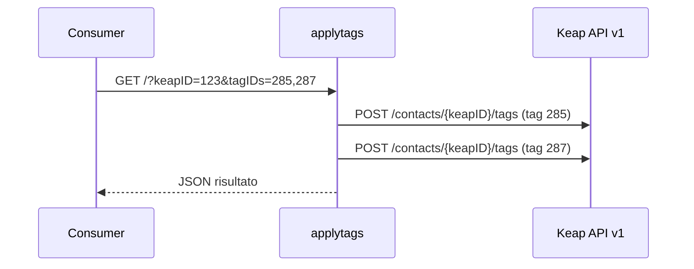

# applytags

> Ultima revisione: 2026-03-26

## Scopo

Worker semplice e monouso per l'**applicazione di tag** a contatti Keap. Riceve un ID contatto e una lista di tag ID via query string e li applica tramite l'API REST Keap v1. [Confermato da codice]

## Stato

**Attivo** — Worker in uso da parte di molteplici consumer, ~86 linee di codice. [Confermato da codice]

---

## Entry Points

| Tipo | Dettaglio |
|------|-----------|
| HTTP | Route `GET` con query params |
| Cron | Nessuno |
| Service Binding | Esposto come `APPLY_TAGS` — chiamato da `linkforreferral` [Confermato da codice] |

---

## Routes

| Metodo | Path | Descrizione | Stato |
|--------|------|-------------|-------|
| `GET` | `/` | Applica tag al contatto specificato | Attivo [Confermato da codice] |

---

## Input/Output

### GET /?keapID=X&tagIDs=1,2,3

**Request (query params):**

| Parametro | Tipo | Obbligatorio | Descrizione |
|-----------|------|:------------:|-------------|
| `keapID` | string | Si | ID del contatto Keap |
| `tagIDs` | string | Si | Lista di tag ID separati da virgola (es. `285,287,289`) |

**Response (successo):**
```json
{
  "success": true
}
```
[Inferito da contesto]

**Response (errore):**
```json
{
  "error": "messaggio di errore"
}
```
[Inferito da contesto]

---

## CORS

| Header | Valore |
|--------|--------|
| `Access-Control-Allow-Origin` | `https://promoepilazione.it` [Confermato da codice] |

---

## Variabili d'ambiente

| Variabile | Tipo | Descrizione |
|-----------|------|-------------|
| `KEAP_API_KEY` | Secret | Personal Access Key (PAK token) per API Keap v1 [Confermato da codice] |

---

## Servizi esterni

| Servizio | Utilizzo | Autenticazione |
|----------|----------|---------------|
| Keap REST API v1 | Applicazione tag a contatti | PAK token [Confermato da codice] |

---

## Consumer

| Consumer | Tipo | Contesto |
|----------|------|----------|
| `linkforreferral` worker | Service Binding (`APPLY_TAGS`) | Applica tag referral a referrer e nuovo contatto [Confermato da codice] |
| Script Airtable `conferma_recensione` | Chiamata HTTP | Applica tag dopo conferma recensione [Confermato da codice] |
| Script Airtable `pacco_consegnato` | Chiamata HTTP | Applica tag dopo consegna pacco [Confermato da codice] |
| Script Airtable `puntuale_e_premiata` | Chiamata HTTP | Applica tag per cliente puntuale [Confermato da codice] |

---

## Flusso logico


[Inferito da contesto]

---

## Criticita e note

| # | Tipo | Descrizione | Gravita |
|---|------|-------------|---------|
| 1 | **Error handling minimo** | Solo try/catch basico, nessuna gestione specifica di errori API Keap (rate limit, token scaduto, contatto inesistente) | Bassa [Confermato da codice] |
| 2 | **Nessuna autenticazione** | L'endpoint e accessibile senza autenticazione — chiunque conosca l'URL puo applicare tag | Media [Inferito da contesto] |
| 3 | **Metodo GET per operazione di scrittura** | Usa GET per un'operazione che modifica dati — non RESTful, potenzialmente problematico con caching/prefetch | Bassa [Confermato da codice] |
