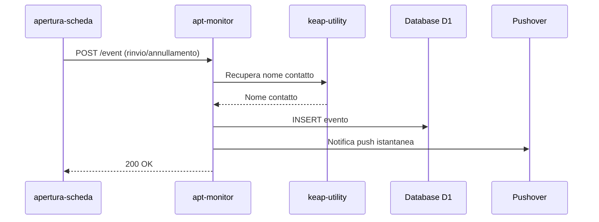
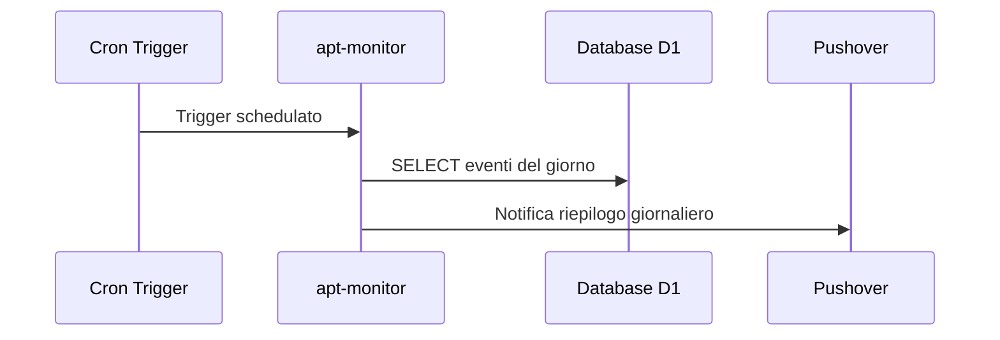

# apt-monitor

> Ultima revisione: 2026-03-26

## Scopo

Worker per il **monitoraggio degli eventi appuntamento** (rinvii e annullamenti). Riceve eventi dal worker `apertura-scheda`, li registra in un database D1, invia notifiche push istantanee e produce un riepilogo giornaliero alle 20:00. [Confermato da codice]

## Stato

**Attivo** — ~318 linee di codice. [Confermato da codice]

---

## Entry Points

| Tipo | Dettaglio |
|------|-----------|
| HTTP | Route `POST /event`, `GET /health` |
| Cron | Trigger schedulato alle 20:00 Europe/Rome per riepilogo giornaliero [Confermato da codice] |
| Service Binding | Non esposto come binding |

---

## Routes

| Metodo | Path | Descrizione | Stato |
|--------|------|-------------|-------|
| `POST` | `/event` | Riceve un evento rinvio/annullamento e lo registra | Attivo [Confermato da codice] |
| `GET` | `/health` | Health check | Attivo [Confermato da codice] |

---

## Input/Output

### POST /event

**Request:**
```json
{
  "type": "rinvio",
  "contactId": 12345,
  "appointmentId": 67890,
  "centro": "Portici",
  "details": "..."
}
```
[Inferito da contesto — struttura esatta da verificare]

**Comportamento:**
1. Recupera il nome del contatto tramite il service binding `KEAP_UTILITY` [Confermato da codice]
2. Registra l'evento nel database D1 [Confermato da codice]
3. Invia notifica push istantanea via Pushover [Confermato da codice]

---

## Cron — Riepilogo giornaliero (20:00)

| Orario | Timezone | Descrizione |
|--------|----------|-------------|
| 20:00 | Europe/Rome | Genera e invia riepilogo giornaliero degli eventi via Pushover [Confermato da codice] |

Il riepilogo aggrega tutti gli eventi di rinvio e annullamento registrati durante la giornata e li invia come singola notifica push. [Confermato da codice]

---

## Storage

| Tipo | Nome | Utilizzo |
|------|------|----------|
| D1 | `DB` | Database per la registrazione degli eventi appuntamento [Confermato da codice] |

---

## Variabili d'ambiente

| Variabile | Tipo | Descrizione |
|-----------|------|-------------|
| `DB` | Binding | Database D1 per gli eventi [Confermato da codice] |
| `KEAP_UTILITY` | Service Binding | Collegamento al worker `keap-utility` per recuperare info contatti [Confermato da codice] |
| `PUSHOVER_TOKEN` | Secret | Token API Pushover [Confermato da codice] |
| `PUSHOVER_USER` | Secret | User key Pushover [Confermato da codice] |
| `PUSHOVER_DEVICE` | Config | Device target per le notifiche Pushover [Confermato da codice] |
| `PUSHOVER_TITLE` | Config | Titolo delle notifiche Pushover [Confermato da codice] |

---

## Servizi esterni

| Servizio | Utilizzo | Autenticazione |
|----------|----------|---------------|
| Pushover | Notifiche push istantanee + riepilogo giornaliero | Token + User [Confermato da codice] |

---

## Dipendenze interne

| Worker | Tipo | Utilizzo |
|--------|------|----------|
| `keap-utility` | Service Binding (`KEAP_UTILITY`) | Recupero nome contatto dato il contactId [Confermato da codice] |
| `apertura-scheda` | Chiamante | Invia eventi di rinvio/annullamento a questo worker [Confermato da codice] |

---

## Flusso logico

### Evento istantaneo



### Riepilogo giornaliero (Cron 20:00)



[Confermato da codice]

---

## Criticita e note

| # | Tipo | Descrizione | Gravita |
|---|------|-------------|---------|
| 1 | **Dipendenza da keap-utility** | Se il service binding `KEAP_UTILITY` non risponde, la registrazione dell'evento potrebbe fallire | Media [Inferito da contesto] |
| 2 | **Nessuna autenticazione** | L'endpoint `/event` e accessibile senza autenticazione | Media [Inferito da contesto] |
