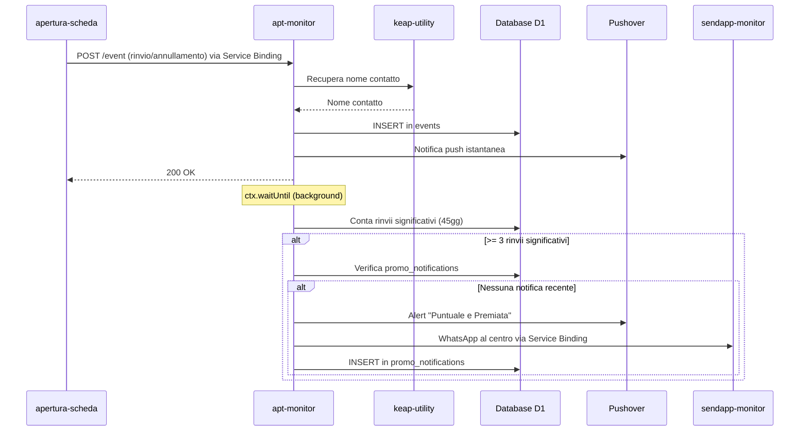
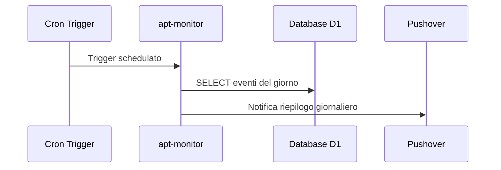

# apt-monitor

> Ultima revisione: 2026-04-02

## Scopo

Worker per il **monitoraggio degli eventi appuntamento** (rinvii e annullamenti). Riceve eventi dal worker `apertura-scheda`, li registra in un database D1, invia notifiche push istantanee e produce un riepilogo giornaliero alle 20:00. Implementa inoltre la logica di rilevamento automatico per la promozione **"Puntuale e Premiata"**.

## Stato

**Attivo** — aggiornato il 2026-04-02 con logica promo.

---

## Entry Points

| Tipo | Dettaglio |
|------|-----------|
| HTTP | Route `POST /event`, `GET /health` |
| Cron | Trigger schedulato alle 20:00 Europe/Rome per riepilogo giornaliero |
| Service Binding | Esposto come `APT-MONITOR` verso `apertura-scheda` |

---

## Routes

| Metodo | Path | Descrizione | Stato |
|--------|------|-------------|-------|
| `POST` | `/event` | Riceve un evento rinvio/annullamento e lo registra | Attivo |
| `GET` | `/health` | Health check | Attivo |

---

## Input/Output

### POST /event

**Request (inviata da `apertura-scheda` via Service Binding):**
```json
{
  "aptId": "12345",
  "customerId": "67890",
  "originalDate": "15/03/2026",
  "newDate": "01/05/2026",
  "value": 49.90,
  "treatments": "Ascelle + Inguine",
  "center": "Portici",
  "status": "rinvio"
}
```

| Campo | Tipo | Note |
|-------|------|------|
| `aptId` | string/number | ID appuntamento Keap |
| `customerId` | string/number | ID contatto Keap |
| `originalDate` | string | Data vecchia (dd/mm/yyyy o yyyy-mm-dd o ISO) |
| `newDate` | string | Data nuova — obbligatorio se status='rinvio' |
| `value` | number/string | Valore in euro (es. 49.90 o "49,90") |
| `treatments` | string | Trattamenti dell'appuntamento |
| `center` | string | Nome del centro (es. "Portici") |
| `status` | string | "rinvio" oppure "annullamento" |

**Comportamento:**
1. Recupera il nome del contatto tramite il service binding `KEAP_UTILITY`
2. Registra l'evento nel database D1 (tabella `events`)
3. Invia notifica push istantanea via Pushover
4. Se `status === "rinvio"`: esegue in background il controllo promo "Puntuale e Premiata"

---

## Cron — Riepilogo giornaliero (20:00)

| Orario | Timezone | Descrizione |
|--------|----------|-------------|
| 20:00 | Europe/Rome | Genera e invia riepilogo giornaliero degli eventi via Pushover |

---

## Schema D1

### Tabella `events`

| Colonna | Tipo | Descrizione |
|---------|------|-------------|
| `id` | INTEGER PK | Auto-increment |
| `apt_id` | TEXT | ID appuntamento Keap |
| `keap_contact_id` | TEXT | ID contatto Keap |
| `center` | TEXT | Nome del centro |
| `status` | TEXT | "rinvio" o "annullamento" |
| `original_date` | TEXT | Data originale in formato `dd-mm-yyyy` |
| `new_date` | TEXT | Nuova data in formato `dd-mm-yyyy` (null se annullamento) |
| `value_cents` | INTEGER | Valore in centesimi |
| `treatments` | TEXT | Trattamenti |
| `contact_given_name` | TEXT | Nome contatto (da keap-utility) |
| `contact_family_name` | TEXT | Cognome contatto (da keap-utility) |
| `local_day` | TEXT | Giorno locale Europe/Rome (per riepilogo cron) |
| `created_at` | TEXT | Timestamp ISO UTC inserimento |

### Tabella `promo_notifications`

| Colonna | Tipo | Descrizione |
|---------|------|-------------|
| `id` | INTEGER PK | Auto-increment |
| `keap_contact_id` | TEXT | ID contatto Keap |
| `center` | TEXT | Nome del centro |
| `notified_at` | TEXT | Timestamp ISO UTC della notifica inviata |

Questa tabella previene le notifiche duplicate per la promo "Puntuale e Premiata": se esiste un record per un contatto con `notified_at` negli ultimi 45 giorni, la notifica viene soppressa.

---

## Logica promo "Puntuale e Premiata"

### Trigger

Attivata in background (`ctx.waitUntil`) dopo ogni evento di tipo `rinvio`.

### Definizione di rinvio significativo

Un rinvio è considerato significativo solo se:
- La `new_date` è successiva alla `original_date` (non è un anticipo)
- La differenza tra `new_date` e `original_date` è **maggiore di 7 giorni**

### Soglia

Se un contatto accumula **3 o più rinvii significativi negli ultimi 45 giorni**, scatta la notifica.

### Finestra temporale

I 45 giorni sono calcolati a partire dal `created_at` del rinvio (quando è stato registrato), non dalla data dell'appuntamento.

### Notifiche inviate

| Canale | Destinatario | Formato |
|--------|-------------|---------|
| Pushover | Giuseppe | Titolo: "⚠️ Puntuale e Premiata" / Messaggio: "[Nome] - [Centro] ha raggiunto 3 rinvii significativi negli ultimi 45 giorni." |
| WhatsApp | Numero del centro coinvolto | "⚠️ Puntuale e Premiata: [Nome] ha effettuato 3 rinvii significativi negli ultimi 45 giorni. Valuta se attivare la promo." |

### Prevenzione duplicati

Prima di inviare, il worker verifica la tabella `promo_notifications`. Se esiste già una notifica per quel contatto negli ultimi 45 giorni, non ne viene inviata un'altra. Dopo l'invio, il record viene inserito nella tabella.

### Numeri WhatsApp dei centri (per notifica promo)

| Centro | Numero |
|--------|--------|
| Portici | 393270944706 |
| Arzano | 393518773260 |
| Torre del Greco | 393514583323 |
| Pomigliano | 390813445902 |

I messaggi WhatsApp sono inviati tramite il service binding `SENDAPP_MONITOR` (instance ID fisso: `69CE7D5C5BDDC`).

---

## Storage

| Tipo | Nome | Utilizzo |
|------|------|----------|
| D1 | `DB` | Database per eventi appuntamento e notifiche promo |

---

## Variabili d'ambiente

| Variabile | Tipo | Descrizione |
|-----------|------|-------------|
| `DB` | Binding | Database D1 |
| `KEAP_UTILITY` | Service Binding | Worker `keap-utility` per recupero info contatti |
| `SENDAPP_MONITOR` | Service Binding | Worker `sendapp-monitor` per invio WhatsApp promo |
| `PUSHOVER_TOKEN` | Secret | Token API Pushover |
| `PUSHOVER_USER` | Secret | User key Pushover |
| `PUSHOVER_DEVICE` | Config | Device target Pushover |
| `PUSHOVER_TITLE` | Config | Titolo default notifiche |
| `SENDAPP_ACCESS_TOKEN` | Secret | Access token per autenticazione verso sendapp-monitor |

---

## Servizi esterni

| Servizio | Utilizzo | Autenticazione |
|----------|----------|---------------|
| Pushover | Notifiche push istantanee + riepilogo giornaliero + alert promo | Token + User |

---

## Dipendenze interne

| Worker | Tipo | Utilizzo |
|--------|------|----------|
| `keap-utility` | Service Binding (`KEAP_UTILITY`) | Recupero nome contatto dato il contactId |
| `sendapp-monitor` | Service Binding (`SENDAPP_MONITOR`) | Invio messaggi WhatsApp per notifiche promo |
| `apertura-scheda` | Chiamante (via `APT-MONITOR`) | Invia eventi di rinvio/annullamento a questo worker |

---

## Flusso logico

### Evento istantaneo



### Riepilogo giornaliero (Cron 20:00)



---

## Criticità e note

| # | Tipo | Descrizione | Gravità |
|---|------|-------------|---------|
| 1 | **Dipendenza da keap-utility** | Se KEAP_UTILITY non risponde, il nome contatto sarà stringa vuota ma la registrazione prosegue | Media |
| 2 | **Nessuna autenticazione** | L'endpoint `/event` è accessibile senza autenticazione | Media |
| 3 | **Formato date** | Le date sono normalizzate e salvate in formato `dd-mm-yyyy`. La logica promo le confronta tramite parsing esplicito | Bassa |
