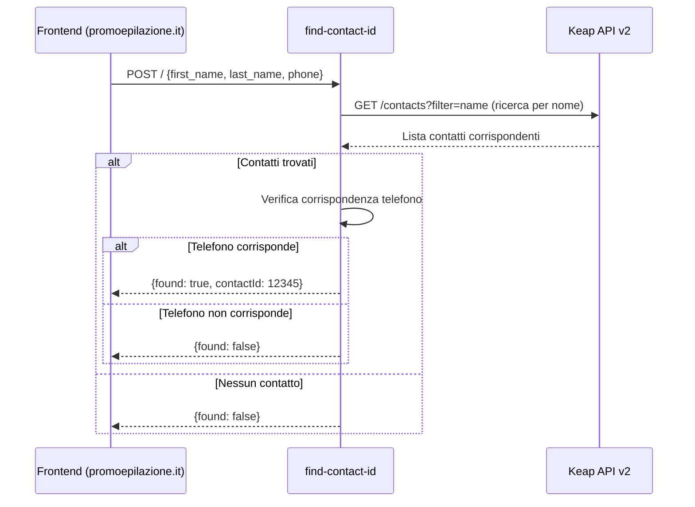

# find-contact-id

> Ultima revisione: 2026-03-26

## Scopo

Worker per la **ricerca di contatti Keap** per nome e verifica tramite numero di telefono. Utilizzato dal frontend per trovare l'ID di un contatto esistente. [Confermato da codice]

## Stato

**Attivo ma con bug** — ~132 linee di codice. Contiene un typo che puo causare errori runtime. [Confermato da codice]

---

## Entry Points

| Tipo | Dettaglio |
|------|-----------|
| HTTP | Route `POST /` |
| Cron | Nessuno |
| Service Binding | Non esposto come binding |

---

## Routes

| Metodo | Path | Descrizione | Stato |
|--------|------|-------------|-------|
| `POST` | `/` | Cerca contatto per nome e verifica telefono | Attivo [Confermato da codice] |

---

## Input/Output

### POST /

**Request:**
```json
{
  "first_name": "Mario",
  "last_name": "Rossi",
  "phone": "+393331234567"
}
```
[Confermato da codice]

**Response (contatto trovato):**
```json
{
  "found": true,
  "contactId": 12345
}
```
[Inferito da contesto]

**Response (non trovato):**
```json
{
  "found": false
}
```
[Inferito da contesto]

---

## CORS

| Header | Valore |
|--------|--------|
| `Access-Control-Allow-Origin` | `https://promoepilazione.it` [Confermato da codice] |

---

## Variabili d'ambiente

| Variabile | Tipo | Descrizione |
|-----------|------|-------------|
| `KEAP_API_KEY` | Secret | Personal Access Key per API Keap v2 [Confermato da codice] |

---

## Servizi esterni

| Servizio | Utilizzo | Autenticazione |
|----------|----------|---------------|
| Keap REST API v2 | Ricerca contatti per nome | PAK token [Confermato da codice] |

---

## Flusso logico


[Inferito da contesto]

---

## Criticita e note

| # | Tipo | Descrizione | Gravita |
|---|------|-------------|---------|
| 1 | **BUG: typo `contatti.lenght`** | Il codice usa `contatti.lenght` invece di `contatti.length`. Questo fa si che il controllo risulti sempre `undefined` (falsy), causando un return "not found" anche quando i contatti vengono effettivamente trovati dall'API. Il bug potrebbe essere mascherato se il flusso non raggiunge mai quel ramo di codice. | **Alta** [Confermato da codice] |
| 2 | **Nessuna autenticazione** | L'endpoint e accessibile senza autenticazione | Media [Inferito da contesto] |
| 3 | **Usato dal frontend** | Chiamato da promoepilazione.it per la ricerca contatti | Info [Inferito da contesto] |
