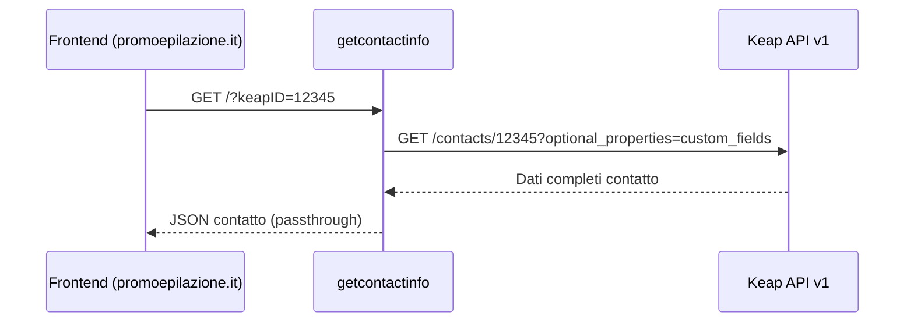

# getcontactinfo

> Ultima revisione: 2026-03-26

## Scopo

Worker per il **recupero delle informazioni complete di un contatto Keap**, inclusi i custom fields. Restituisce i dati di un contatto dato il suo ID. [Confermato da codice]

## Stato

**Attivo** — ~91 linee di codice. Potrebbe essere ridondante con la route `/getContactInfo/:id` del worker `keap-utility`. [Da verificare]

---

## Entry Points

| Tipo | Dettaglio |
|------|-----------|
| HTTP | Route `GET` con query param |
| Cron | Nessuno |
| Service Binding | Non esposto come binding |

---

## Routes

| Metodo | Path | Descrizione | Stato |
|--------|------|-------------|-------|
| `GET` | `/?keapID=X` | Restituisce info complete del contatto | Attivo [Confermato da codice] |

---

## Input/Output

### GET /?keapID=X

**Request (query params):**

| Parametro | Tipo | Obbligatorio | Descrizione |
|-----------|------|:------------:|-------------|
| `keapID` | string | Si | ID del contatto Keap |

**Response (successo):**
```json
{
  "id": 12345,
  "given_name": "Mario",
  "family_name": "Rossi",
  "email_addresses": [...],
  "phone_numbers": [...],
  "custom_fields": [
    { "id": 41, "content": "Portici" },
    { "id": 165, "content": "67F7E1DA0EF73" }
  ]
}
```
[Inferito da contesto — risposta Keap v1 passata direttamente]

---

## CORS

| Header | Contesto | Valore |
|--------|----------|--------|
| `Access-Control-Allow-Origin` | Risposta di successo | `*` (wildcard) [Confermato da codice] |
| `Access-Control-Allow-Origin` | Risposta di errore | `https://promoepilazione.it` [Confermato da codice] |

> **Nota:** L'inconsistenza nei CORS header tra successo ed errore e un difetto nel codice. La risposta di successo usa `*` (accesso aperto da qualsiasi origine) mentre la risposta di errore restringe a `promoepilazione.it`. [Confermato da codice]

---

## Variabili d'ambiente

| Variabile | Tipo | Descrizione |
|-----------|------|-------------|
| `KEAP_API_KEY` | Secret | Personal Access Key per API Keap v1 [Confermato da codice] |

---

## Servizi esterni

| Servizio | Utilizzo | Autenticazione |
|----------|----------|---------------|
| Keap REST API v1 | Recupero dati contatto con custom fields | PAK token [Confermato da codice] |

---

## Flusso logico


[Inferito da contesto]

---

## Criticita e note

| # | Tipo | Descrizione | Gravita |
|---|------|-------------|---------|
| 1 | **CORS inconsistenti** | `Access-Control-Allow-Origin: *` nelle risposte di successo ma `promoepilazione.it` nelle risposte di errore. Dovrebbe essere uniforme. | Bassa [Confermato da codice] |
| 2 | **Possibile ridondanza** | Il worker `keap-utility` espone una route `/getContactInfo/:id` che potrebbe fornire la stessa funzionalita. Verificare se questo worker puo essere deprecato in favore di keap-utility. | Media [Da verificare] |
| 3 | **Nessuna autenticazione** | L'endpoint e accessibile senza autenticazione | Media [Inferito da contesto] |
| 4 | **Usato dal frontend** | Chiamato da promoepilazione.it per recupero dati contatto | Info [Inferito da contesto] |
