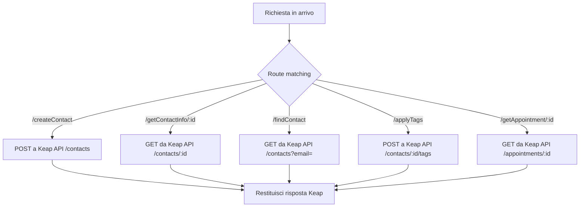

# keap-utility

> Ultima revisione: 2026-03-26

## Scopo

Proxy centralizzato per le API Keap. Espone un'interfaccia semplificata per operazioni comuni (creazione contatti, lettura info, applicazione tag, gestione appuntamenti) ed e utilizzato da altri worker tramite **Service Binding**. [Confermato da codice]

## Stato

**Attivo** — ~246 linee di codice. [Confermato da codice]

---

## Entry Points

| Tipo | Dettaglio |
|------|-----------|
| HTTP | Route dirette (principalmente per debug/test) |
| Service Binding | Esposto come `KEAP_UTILITY` — usato da `lead-handler`, `apt-monitor`, `prebooking` [Confermato da codice] |

---

## Routes

| Metodo | Path | Descrizione |
|--------|------|-------------|
| `POST` | `/createContact` | Crea contatto in Keap [Confermato da codice] |
| `GET` | `/getContactInfo/:id` | Recupera info contatto per ID [Confermato da codice] |
| `GET` | `/findContact?email=` | Cerca contatto per email [Confermato da codice] |
| `POST` | `/applyTags` | Applica tag a un contatto [Confermato da codice] |
| `GET` | `/getAppointment/:id` | Recupera dati appuntamento [Confermato da codice] |

---

## Input/Output

### POST /createContact

**Request:**
```json
{
  "email_addresses": [{ "email": "mario@example.com", "field": "EMAIL1" }],
  "given_name": "Mario",
  "family_name": "Rossi",
  "phone_numbers": [{ "number": "+393331234567", "field": "PHONE1" }]
}
```
[Inferito da contesto — segue formato Keap API]

**Response:** JSON contatto Keap creato

### GET /getContactInfo/:id

**Response:**
```json
{
  "id": 12345,
  "given_name": "Mario",
  "family_name": "Rossi",
  "email_addresses": [...],
  "custom_fields": [...]
}
```
[Inferito da contesto]

### POST /applyTags

**Request:**
```json
{
  "contactId": 12345,
  "tagIds": [285, 287]
}
```
[Inferito da contesto]

---

## Storage

| Tipo | Nome | Utilizzo |
|------|------|----------|
| KV | `KEAP_TOKENS` | Token OAuth (se usa OAuth e non solo PAK) [Da verificare] |

---

## Variabili d'ambiente

| Variabile | Tipo | Descrizione |
|-----------|------|-------------|
| `KEAP_ACCESS_TOKEN` | Secret | Access token Keap [Confermato da codice] |

---

## Servizi esterni

| Servizio | Utilizzo |
|----------|----------|
| Keap REST API v1/v2 | Tutte le operazioni CRUD su contatti, tag, appuntamenti [Confermato da codice] |

---

## Flusso logico



Il worker agisce come **passthrough** verso le API Keap, aggiungendo: [Confermato da codice]
1. Gestione automatica dell'autenticazione (token)
2. Error handling centralizzato
3. Interfaccia semplificata per i worker consumatori

---

## Configurazione hardcoded

Nessuna configurazione hardcoded significativa — il worker e generico e non contiene mappature specifiche per centro. [Confermato da codice]

---

## Criticita e note

| # | Tipo | Descrizione | Gravita |
|---|------|-------------|---------|
| 1 | **Single point of failure** | Tutti i worker che usano il binding dipendono da questo worker. Un suo malfunzionamento blocca `lead-handler`, `apt-monitor` e `prebooking` | Alta [Confermato da codice] |
| 2 | **Token management** | Da chiarire se usa OAuth con refresh o solo un access token statico | Media [Da verificare] |
| 3 | **Nessun rate limiting** | Non implementa rate limiting verso Keap — un picco di richieste potrebbe esaurire le quote API | Bassa [Inferito da contesto] |
