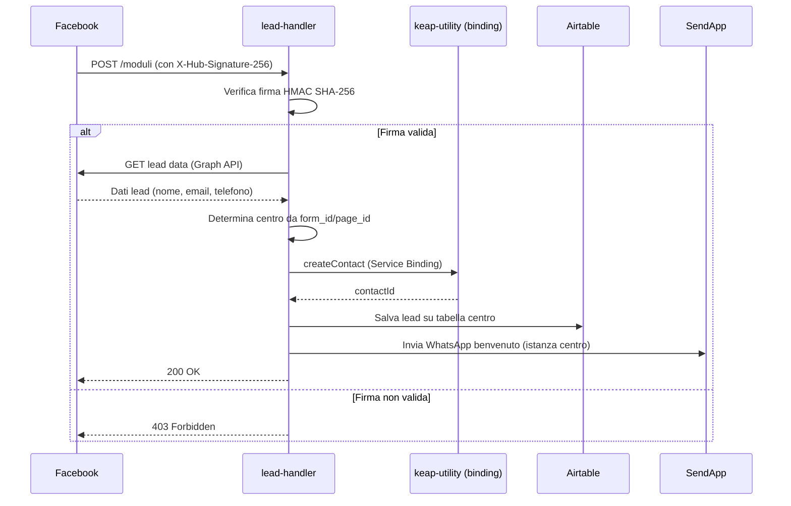

# lead-handler

> Ultima revisione: 2026-03-26

## Scopo

Cattura lead da **Facebook Lead Ads** (webhook Meta) e da **form generici**. Per ogni lead: crea il contatto in Keap (via Service Binding), salva i dati su Airtable e invia un messaggio WhatsApp di benvenuto via SendApp. [Confermato da codice]

## Stato

**Attivo** — ~544 linee di codice. [Confermato da codice]

---

## Entry Points

| Tipo | Dettaglio |
|------|-----------|
| HTTP | `POST /moduli` (webhook Meta), `POST /form` (form generico) |
| Service Binding | Usa `KEAP_UTILITY` per creare contatti e applicare tag [Confermato da codice] |

---

## Routes

| Metodo | Path | Descrizione | Auth |
|--------|------|-------------|------|
| `POST` | `/moduli` | Webhook Facebook Lead Ads | HMAC SHA-256 [Confermato da codice] |
| `POST` | `/form` | Form semplice per lead manuali | No [Inferito da contesto] |

---

## Input/Output

### POST /moduli (Facebook Webhook)

**Request:** Payload standard Meta Lead Ads
```json
{
  "entry": [{
    "changes": [{
      "value": {
        "leadgen_id": "123456789",
        "page_id": "987654321",
        "form_id": "111222333",
        "field_data": [
          { "name": "full_name", "values": ["Mario Rossi"] },
          { "name": "email", "values": ["mario@example.com"] },
          { "name": "phone_number", "values": ["+393331234567"] }
        ]
      }
    }]
  }]
}
```
[Inferito da contesto — formato standard Meta]

**Response:** `200 OK` (richiesto da Meta per conferma ricezione)

### POST /form

**Request:**
```json
{
  "nome": "Mario",
  "cognome": "Rossi",
  "email": "mario@example.com",
  "telefono": "+393331234567",
  "centro": "portici"
}
```
[Inferito da contesto]

---

## Storage

| Tipo | Nome | Utilizzo |
|------|------|----------|
| Service Binding | `KEAP_UTILITY` | Creazione contatto e applicazione tag in Keap [Confermato da codice] |

---

## Variabili d'ambiente

| Variabile | Tipo | Descrizione |
|-----------|------|-------------|
| `VERIFY_TOKEN` | Secret | Token verifica webhook Meta (challenge) [Confermato da codice] |
| `APP_SECRET` | Secret | Facebook App Secret per verifica HMAC [Confermato da codice] |
| `PAGE_TOKENS_JSON` | Secret | JSON con mapping page_id -> page_token [Confermato da codice] |
| `GRAPH_TOKEN` | Secret | Token Graph API per recupero dati lead [Confermato da codice] |
| `AIRTABLE_API_KEY` | Secret | API Key Airtable per salvataggio lead [Confermato da codice] |

---

## Servizi esterni

| Servizio | Utilizzo | Autenticazione |
|----------|----------|---------------|
| Facebook Graph API | Recupero dati lead da leadgen_id | Graph Token [Confermato da codice] |
| Keap API | Creazione contatto (via KEAP_UTILITY binding) | Gestito dal binding [Confermato da codice] |
| Airtable | Salvataggio lead per centro | API Key [Confermato da codice] |
| SendApp | Invio WhatsApp di benvenuto | Instance ID per centro [Confermato da codice] |

---

## Flusso logico

### Webhook Facebook (/moduli)



### Form generico (/form)

1. Riceve dati dal form
2. Crea contatto in Keap via KEAP_UTILITY
3. Salva su Airtable (tabella del centro)
4. Invia WhatsApp di benvenuto

[Confermato da codice]

---

## Configurazione hardcoded

### AIRTABLE_ROUTES — Mapping centro -> base/tabella Airtable

[Confermato da codice]

| Centro | Base ID | Table ID |
|--------|---------|----------|
| Arzano | `appMoFcRmbgI8rpH8` | `tblNNPcer4NqOqrpM` |
| Portici | `appWPbF9yD2PtQrEm` | `tbl21en6aDhgcD7T0` |
| Torre del Greco | `appCVqkej3tDupAQP` | `tblL6YNidW44GXBEq` |
| Pomigliano | `""` (vuoto) | `""` (vuoto) |

### SendApp Instance ID per centro

[Confermato da codice]

| Centro | Instance ID |
|--------|-------------|
| Portici | `67F7E1DA0EF73` |
| Arzano | `67EFB424D2353` |
| Torre del Greco | `67EFB605B93A1` |
| Pomigliano | `68BFEBB41DDD0` |

---

## Criticita e note

| # | Tipo | Descrizione | Gravita |
|---|------|-------------|---------|
| 1 | **Pomigliano Airtable mancante** | Base e tabella Airtable per Pomigliano sono stringhe vuote — i lead di questo centro NON vengono salvati su Airtable | Alta [Confermato da codice] |
| 2 | **Discrepanza SendApp Pomigliano** | L'Instance ID di Pomigliano qui e `68BFEBB41DDD0`, diverso da `6926D352155D3` usato in `apertura-scheda` | Alta [Confermato da codice] |
| 3 | **Sicurezza webhook** | La verifica HMAC SHA-256 e implementata correttamente per il webhook Meta | Positivo [Confermato da codice] |
| 4 | **Form senza auth** | L'endpoint `/form` non ha verifica di firma — chiunque puo inviare lead falsi | Media [Inferito da contesto] |
| 5 | **Token Facebook** | I page token hanno scadenza e richiedono rinnovo manuale periodico | Media [Inferito da contesto] |
