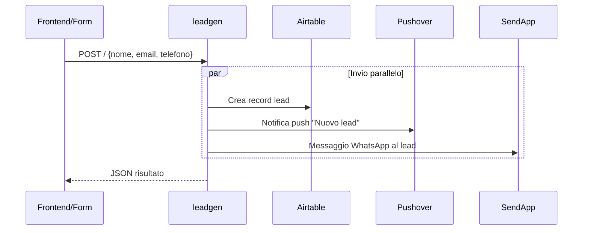

# leadgen

> Ultima revisione: 2026-03-26

## Scopo

Worker legacy per la **gestione dei lead in ingresso**. Riceve i dati di un nuovo lead e li distribuisce in parallelo ad Airtable, Pushover e WhatsApp (SendApp). [Confermato da codice]

## Stato

**Legacy** — ~161 linee di codice. Sostituito da `lead-handler` che supporta multi-centro e Facebook webhook. [Inferito da contesto]

---

## Entry Points

| Tipo | Dettaglio |
|------|-----------|
| HTTP | Route `POST /` |
| Cron | Nessuno |
| Service Binding | Non esposto come binding |

---

## Routes

| Metodo | Path | Descrizione | Stato |
|--------|------|-------------|-------|
| `POST` | `/` | Riceve dati lead e li distribuisce | Legacy [Inferito da contesto] |

---

## Input/Output

### POST /

**Request:**
```json
{
  "nome": "Mario Rossi",
  "email": "mario@example.com",
  "telefono": "+393331234567"
}
```
[Confermato da codice]

**Campi obbligatori:** `nome`, `email`, `telefono` [Confermato da codice]

**Comportamento:**
Invia i dati in parallelo a tre servizi: [Confermato da codice]

1. **Airtable** — crea record nella tabella specificata
2. **Pushover** — invia notifica push
3. **WhatsApp (SendApp)** — invia messaggio WhatsApp al lead

---

## Variabili d'ambiente

| Variabile | Tipo | Descrizione |
|-----------|------|-------------|
| `AIRTABLE_API_KEY` | Secret | Token API Airtable [Confermato da codice] |
| `AIRTABLE_BASE_ID` | Config | ID della base Airtable (singola, non multi-centro) [Confermato da codice] |
| `AIRTABLE_TABLE_NAME` | Config | Nome della tabella Airtable [Confermato da codice] |
| `PUSHOVER_TOKEN` | Secret | Token API Pushover [Confermato da codice] |
| `PUSHOVER_USER` | Secret | User key Pushover [Confermato da codice] |
| `SENDAPP_API_KEY` | Secret | Chiave API SendApp per invio WhatsApp [Confermato da codice] |

---

## Servizi esterni

| Servizio | Utilizzo | Autenticazione |
|----------|----------|---------------|
| Airtable | Salvataggio lead | Bearer token [Confermato da codice] |
| Pushover | Notifica push nuovo lead | Token + User [Confermato da codice] |
| SendApp | Invio messaggio WhatsApp al lead | API key [Confermato da codice] |

---

## Flusso logico


[Confermato da codice]

---

## Criticita e note

| # | Tipo | Descrizione | Gravita |
|---|------|-------------|---------|
| 1 | **Messaggio WhatsApp placeholder** | Il messaggio WhatsApp e hardcoded come `"[INSERISCI QUI IL TUO MESSAGGIO WHATSAPP]"` — mai configurato con un messaggio reale. Il lead riceve un messaggio placeholder. | **Alta** [Confermato da codice] |
| 2 | **Non multi-centro** | Usa un singolo `AIRTABLE_BASE_ID` — non supporta la gestione di lead per centri diversi (Portici, Arzano, Torre del Greco, Pomigliano) | Media [Confermato da codice] |
| 3 | **Sostituito da lead-handler** | Il worker `lead-handler` fornisce le stesse funzionalita con supporto multi-centro e integrazione Facebook webhook | Info [Inferito da contesto] |
| 4 | **Nessuna validazione input** | Oltre al controllo dei campi obbligatori, non c'e validazione di formato (email, telefono) | Bassa [Inferito da contesto] |
| 5 | **Da dismettere** | Verificare che nessun form o automazione punti ancora a questo worker prima di disattivarlo | Media [Da verificare] |
