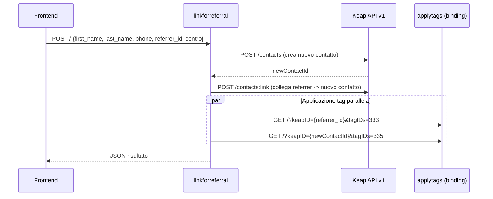

# linkforreferral

> Ultima revisione: 2026-03-26

## Scopo

Worker per la **creazione di link referral** tra contatti Keap. Crea un nuovo contatto, lo collega al referrer tramite l'API Keap e applica i tag appropriati a entrambi i contatti. [Confermato da codice]

## Stato

**Attivo** — ~208 linee di codice. [Confermato da codice]

---

## Entry Points

| Tipo | Dettaglio |
|------|-----------|
| HTTP | Route `POST /` |
| Cron | Nessuno |
| Service Binding | Non esposto come binding; usa `APPLY_TAGS` (service binding verso `applytags`) [Confermato da codice] |

---

## Routes

| Metodo | Path | Descrizione | Stato |
|--------|------|-------------|-------|
| `POST` | `/` | Crea contatto referral e collega al referrer | Attivo [Confermato da codice] |

---

## Input/Output

### POST /

**Request:**
```json
{
  "first_name": "Mario",
  "last_name": "Rossi",
  "phone": "+393331234567",
  "referrer_id": 12345,
  "centro": "Portici"
}
```
[Confermato da codice]

**Centri validi:**

| Centro | Supportato |
|--------|:----------:|
| Portici | Si [Confermato da codice] |
| Arzano | Si [Confermato da codice] |
| Torre del Greco | Si [Confermato da codice] |
| Pomigliano | **No** [Confermato da codice] |

**Response (successo):**
```json
{
  "success": true,
  "newContactId": 67890
}
```
[Inferito da contesto]

---

## Tag applicati

| Tag ID | Nome | Applicato a |
|--------|------|-------------|
| 333 | Referral Inviato | Referrer (contatto esistente) [Confermato da codice] |
| 335 | Referral Ricevuto | Nuovo contatto (referral) [Confermato da codice] |

---

## Variabili d'ambiente

| Variabile | Tipo | Descrizione |
|-----------|------|-------------|
| `KEAP_API_KEY` | Secret | Personal Access Key per API Keap v1 [Confermato da codice] |
| `APPLY_TAGS` | Service Binding | Collegamento al worker `applytags` per applicazione tag [Confermato da codice] |

---

## Servizi esterni

| Servizio | Utilizzo | Autenticazione |
|----------|----------|---------------|
| Keap REST API v1 | Creazione contatto e collegamento referral | PAK token [Confermato da codice] |

---

## Dipendenze interne

| Worker | Tipo | Utilizzo |
|--------|------|----------|
| `applytags` | Service Binding (`APPLY_TAGS`) | Applicazione tag 333 al referrer e tag 335 al nuovo contatto [Confermato da codice] |

---

## Flusso logico


[Inferito da contesto]

---

## Criticita e note

| # | Tipo | Descrizione | Gravita |
|---|------|-------------|---------|
| 1 | **Pomigliano non supportato** | Il centro Pomigliano non e incluso nella lista dei centri validi. Se viene passato come parametro, il comportamento e indefinito. | Media [Confermato da codice] |
| 2 | **Nessuna autenticazione** | L'endpoint e accessibile senza autenticazione | Media [Inferito da contesto] |
| 3 | **Dipendenza da applytags** | L'applicazione dei tag dipende dal service binding verso il worker `applytags` | Bassa [Confermato da codice] |
