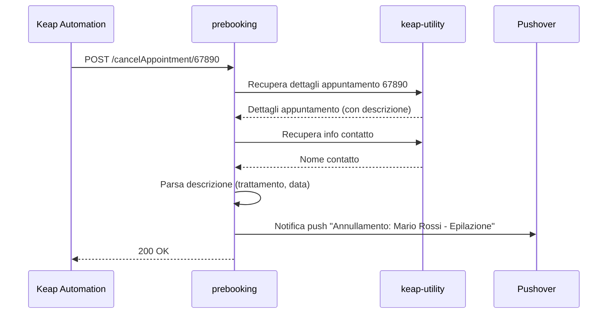

# prebooking

> Ultima revisione: 2026-03-26

## Scopo

Worker piu vecchio per la **gestione degli eventi appuntamento** (cancellazione e rinvio). Gestisce le notifiche push per annullamenti e ripristini di appuntamenti Keap. Contiene anche handler vuoti per `setAppointment` e `setOpportunity` che non sono mai stati implementati. [Confermato da codice]

## Stato

**Parzialmente Legacy** — ~216 linee di codice. Le funzionalita di cancel/reset potrebbero essere ancora chiamate da automazioni Keap. [Da verificare] Le funzioni si sovrappongono parzialmente con le route `/annulla` e `/rinvio` del worker `apertura-scheda`. [Confermato da codice]

---

## Entry Points

| Tipo | Dettaglio |
|------|-----------|
| HTTP | Route `POST /cancelAppointment/:id`, `POST|GET /resetAppointment/:id`, `POST /setAppointment`, `POST /setOpportunity` |
| Cron | Nessuno |
| Service Binding | Non esposto come binding; usa `KEAP_UTILITY` (service binding) [Confermato da codice] |

---

## Routes

| Metodo | Path | Descrizione | Stato |
|--------|------|-------------|-------|
| `POST` | `/cancelAppointment/:id` | Gestisce annullamento appuntamento | Parzialmente Legacy [Da verificare] |
| `POST`, `GET` | `/resetAppointment/:id` | Gestisce ripristino/rinvio appuntamento | Parzialmente Legacy [Da verificare] |
| `POST` | `/setAppointment` | **Handler vuoto** — mai implementato | Non funzionante [Confermato da codice] |
| `POST` | `/setOpportunity` | **Handler vuoto** — mai implementato | Non funzionante [Confermato da codice] |

---

## Input/Output

### POST /cancelAppointment/:id

**Request:**
- `:id` = ID appuntamento Keap (path param)

**Comportamento:**
1. Recupera dettagli appuntamento tramite `KEAP_UTILITY` [Confermato da codice]
2. Recupera info contatto tramite `KEAP_UTILITY` [Confermato da codice]
3. Parsa la descrizione dell'appuntamento per estrarre nome trattamento e data prenotazione [Confermato da codice]
4. Invia notifica push Pushover con dettagli annullamento [Confermato da codice]

### POST|GET /resetAppointment/:id

**Request:**
- `:id` = ID appuntamento Keap (path param)

**Comportamento:**
Analogo a `/cancelAppointment/:id` ma per eventi di rinvio/ripristino. [Confermato da codice]

### POST /setAppointment

**Handler vuoto** — restituisce risposta senza eseguire alcuna logica. [Confermato da codice]

### POST /setOpportunity

**Handler vuoto** — restituisce risposta senza eseguire alcuna logica. [Confermato da codice]

---

## Variabili d'ambiente

| Variabile | Tipo | Descrizione |
|-----------|------|-------------|
| `KEAP_UTILITY` | Service Binding | Collegamento al worker `keap-utility` per recupero info appuntamenti e contatti [Confermato da codice] |
| `PUSHOVER_TOKEN` | Secret | Token API Pushover [Confermato da codice] |
| `PUSHOVER_USER` | Secret | User key Pushover [Confermato da codice] |

---

## Servizi esterni

| Servizio | Utilizzo | Autenticazione |
|----------|----------|---------------|
| Pushover | Notifiche push per cancel/reset | Token + User [Confermato da codice] |

---

## Dipendenze interne

| Worker | Tipo | Utilizzo |
|--------|------|----------|
| `keap-utility` | Service Binding (`KEAP_UTILITY`) | Recupero dettagli appuntamento e info contatto [Confermato da codice] |

---

## Flusso logico

### Cancellazione appuntamento

[Confermato da codice]

---

## Criticita e note

| # | Tipo | Descrizione | Gravita |
|---|------|-------------|---------|
| 1 | **Handler vuoti** | `/setAppointment` e `/setOpportunity` sono handler vuoti, mai implementati. Occupano spazio nel codice senza fornire alcuna funzionalita. | Bassa [Confermato da codice] |
| 2 | **Sovrapposizione con apertura-scheda** | Le funzionalita di cancel e reset si sovrappongono con le route `/annulla` e `/rinvio` del worker `apertura-scheda`. Potrebbe creare confusione su quale endpoint viene effettivamente utilizzato. | Media [Confermato da codice] |
| 3 | **Stato incerto** | Non e chiaro se le automazioni Keap chiamino ancora questo worker o siano state migrate a `apertura-scheda`. Necessaria verifica. | Media [Da verificare] |
| 4 | **Parsing descrizione fragile** | Il parsing della descrizione appuntamento per estrarre trattamento e data e basato su pattern stringa — puo rompersi se il formato della descrizione cambia | Bassa [Confermato da codice] |
