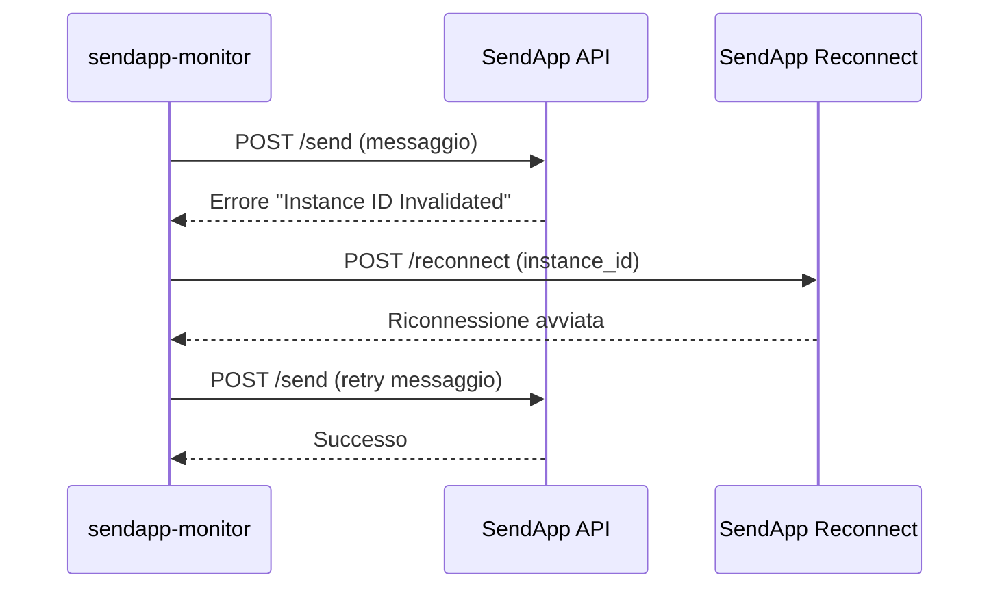
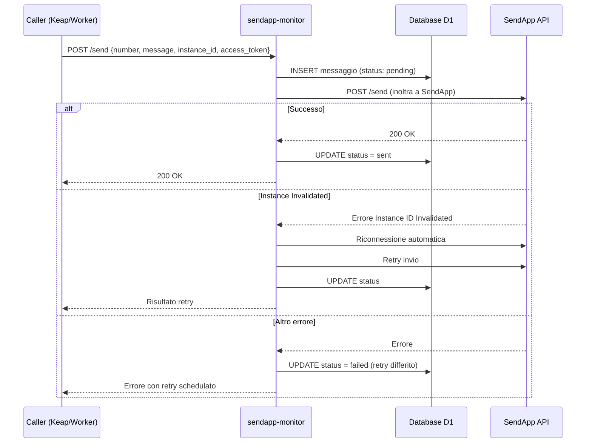

# sendapp-monitor

> Ultima revisione: 2026-03-26

## Scopo

Worker di **infrastruttura per l'invio e il monitoraggio dei messaggi WhatsApp** tramite il provider SendApp. Funge da proxy tra i worker interni (e le automazioni Keap) e l'API SendApp, gestendo l'invio, i retry automatici, la riconnessione delle istanze e il reporting. [Confermato da codice]

## Stato

**Attivo** — Infrastruttura core per tutto il messaging WhatsApp, ~2660 linee di codice (di cui ~950 di polyfill wrangler Cloudflare). [Confermato da codice]

---

## Entry Points

| Tipo | Dettaglio |
|------|-----------|
| HTTP | Route `POST /send`, `GET /report`, `POST /setup`, `POST /webhook` |
| Cron | Trigger orario — report giornaliero alle 09:00 Europe/Rome + cleanup retention [Confermato da codice] |
| Service Binding | Non esposto come binding; chiamato via HTTP da automazioni Keap [Confermato da automations_report.md] |

---

## Routes

| Metodo | Path | Descrizione | Stato |
|--------|------|-------------|-------|
| `POST` | `/send` | Accetta messaggio, lo salva in D1 e lo inoltra a SendApp | Attivo [Confermato da codice] |
| `GET` | `/report` | Genera report HTML delle statistiche messaggi | Attivo [Confermato da codice] |
| `POST` | `/setup` | Inizializza le tabelle nel database D1 | Attivo [Inferito da contesto] |
| `POST` | `/webhook` | Riceve callback di stato consegna da SendApp | Attivo [Inferito da contesto] |

---

## Input/Output

### POST /send

**Request:**
```json
{
  "number": "+393331234567",
  "message": "Ciao Mario, il tuo appuntamento e confermato.",
  "instance_id": "67F7E1DA0EF73",
  "access_token": "..."
}
```
[Confermato da codice]

**Comportamento:**
1. Inserisce il messaggio nel database D1 con stato iniziale [Confermato da codice]
2. Inoltra il messaggio all'API SendApp [Confermato da codice]
3. In caso di errore "Instance ID Invalidated": esegue riconnessione automatica e reinvio [Confermato da codice]
4. In caso di altri errori: attiva meccanismo di retry differito [Confermato da codice]

### GET /report

**Response:** Pagina HTML con statistiche aggregate sui messaggi inviati. [Confermato da codice]

### POST /setup

**Comportamento:** Crea/inizializza le tabelle nel database D1. [Inferito da contesto]

### POST /webhook

**Comportamento:** Riceve callback di stato consegna da SendApp e aggiorna lo stato del messaggio nel database. [Inferito da contesto]

---

## Cron — Handler schedulato (orario)

| Orario | Azione | Descrizione |
|--------|--------|-------------|
| 09:00 Europe/Rome | Report giornaliero | Genera e invia report statistiche del giorno precedente [Confermato da codice] |
| Ogni ora | Cleanup retention | Rimuove messaggi vecchi dal database secondo la policy di retention [Confermato da codice] |

---

## Storage

| Tipo | Nome | Utilizzo |
|------|------|----------|
| D1 | `DB` | Database per messaggi ed eventi [Confermato da codice] |

### Tabelle D1

| Tabella | Colonne | Descrizione |
|---------|---------|-------------|
| `messages` | `id`, `instance_id`, `number`, `message`, `status`, `created_at`, `updated_at` | Registro di tutti i messaggi inviati [Inferito da contesto] |
| `events` | `id`, `type`, `data`, `created_at` | Log eventi (webhook, errori, riconnessioni) [Inferito da contesto] |

---

## Variabili d'ambiente

| Variabile | Tipo | Descrizione |
|-----------|------|-------------|
| `DB` | Binding | Database D1 per messaggi ed eventi [Confermato da codice] |
| `SENDAPP_URL` | Config | URL base dell'API SendApp [Confermato da codice] |
| `RECONNECT_BASE` | Config | URL base per la riconnessione istanze SendApp [Confermato da codice] |
| `TZ` | Config | Timezone (Europe/Rome) [Confermato da codice] |

---

## Servizi esterni

| Servizio | Utilizzo | Autenticazione |
|----------|----------|---------------|
| SendApp API | Invio messaggi WhatsApp | Instance ID + Access Token (per messaggio) [Confermato da codice] |
| SendApp Reconnect | Riconnessione istanze invalidate | Instance ID [Confermato da codice] |

---

## Logica di retry e riconnessione

### Gestione errore "Instance ID Invalidated"


[Confermato da codice]

### Retry differito per altri errori

Quando l'invio fallisce per errori diversi dall'invalidazione dell'istanza, il worker implementa un meccanismo di retry differito che ritenta l'invio in un momento successivo. [Confermato da codice]

---

## Flusso logico principale

### Invio messaggio


[Confermato da codice]

---

## Polyfill Cloudflare

Le prime ~950 linee del file contengono polyfill generati automaticamente dal bundler wrangler di Cloudflare. Questo codice non e logica applicativa ma infrastruttura di compatibilita runtime. [Confermato da codice]

---

## Consumer

| Consumer | Tipo | Contesto |
|----------|------|----------|
| Automazioni Keap | HTTP Request | Invio WhatsApp da step di automazione [Confermato da automations_report.md] |
| `apertura-scheda` worker | HTTP | Invio conferma/rinvio appuntamento via WhatsApp [Inferito da contesto] |
| `lead-handler` worker | HTTP | Invio messaggio di benvenuto a nuovi lead [Inferito da contesto] |

---

## Criticita e note

| # | Tipo | Descrizione | Gravita |
|---|------|-------------|---------|
| 1 | **Dimensione codice** | ~2660 linee totali, di cui ~950 di polyfill. Il file e molto grande e difficile da leggere/manutenere. | Media [Confermato da codice] |
| 2 | **Polyfill inline** | I ~950 linee di polyfill wrangler sono inclusi direttamente nel file sorgente, anziche gestiti come dipendenza separata | Bassa [Confermato da codice] |
| 3 | **Infrastruttura critica** | Questo worker e il punto di transito per **tutti** i messaggi WhatsApp del sistema. Un malfunzionamento blocca tutte le comunicazioni WhatsApp. | **Alta** [Confermato da codice] |
| 4 | **Nessuna autenticazione** | L'endpoint `/send` e accessibile senza autenticazione — chiunque conosca l'URL puo inviare messaggi WhatsApp | **Alta** [Inferito da contesto] |
| 5 | **Retry senza limite** | Verificare se esiste un limite massimo di retry per evitare loop infiniti su errori persistenti | Media [Da verificare] |
